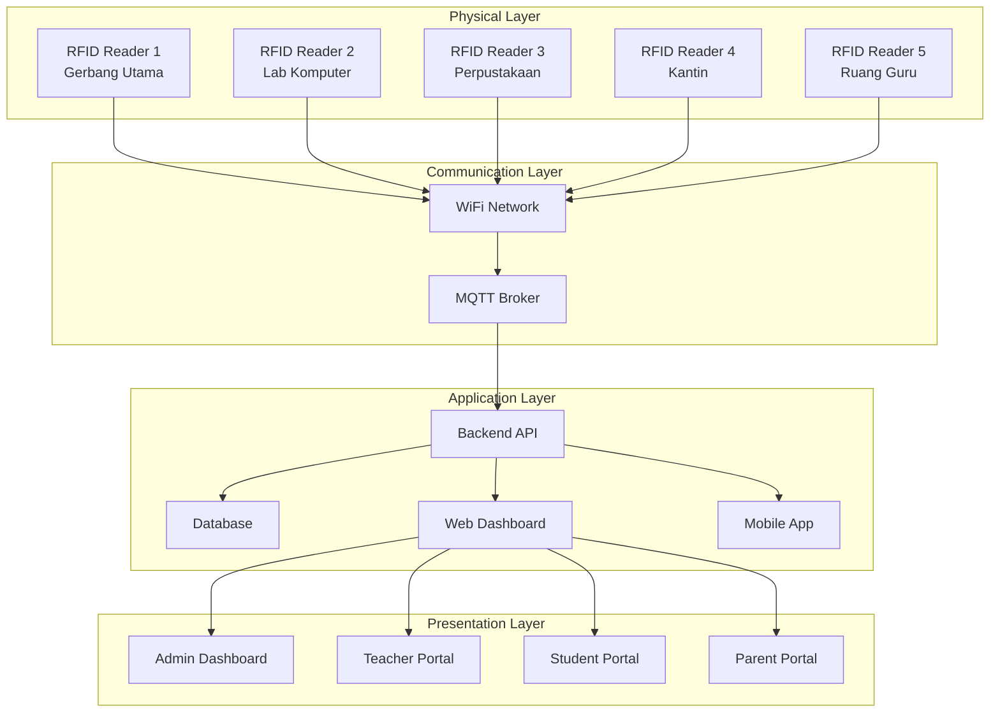

# MATERI PEMBELAJARAN SISTEM ABSENSI IOT RFID DENGAN DASHBOARD WEB DAN TRANSAKSI SALDO SISWA

## Informasi Seminar
**Judul:** "Implementasi Sistem Absensi IoT Berbasis RFID dengan Dashboard Web dan Manajemen Saldo Siswa untuk SMK"

**Target Peserta:** Siswa SMK Kelas X Jurusan Teknik Komputer dan Jaringan (TKJ), Rekayasa Perangkat Lunak (RPL), dan Teknik Elektronika

**Durasi:** 8 jam (2 hari @ 4 jam)

**Tujuan Pembelajaran:**
- Memahami dasar-dasar Arduino dan pemrograman mikrokontroler
- Menguasai konsep input/output digital dan komunikasi I2C
- Memahami konsep Internet of Things (IoT) dan implementasinya
- Menguasai teknologi RFID dan komunikasi I2C
- Mampu mengembangkan sistem backend dengan Node.js dan Express
- Memahami komunikasi MQTT untuk IoT
- Mampu membuat dashboard web responsif
- Memahami integrasi hardware dan software dalam sistem IoT

---

## OUTLINE MATERI

### BAB 1: DASAR-DASAR ARDUINO DAN ESP32 (1.5 jam)
- Pengenalan Arduino dan ESP32
- Setup Arduino IDE dan library
- Konsep input/output digital
- Praktikum: LED Blink dan Push Button
- Komunikasi Serial dan debugging

### BAB 2: KOMUNIKASI I2C DAN SENSOR (1.5 jam)
- Konsep komunikasi I2C
- Praktikum: LCD I2C Display
- Praktikum: RFID Reader I2C (PN532)
- I2C Scanner dan troubleshooting

### BAB 3: PENGENALAN IOT DAN RFID (1 jam)
- Konsep dasar Internet of Things (IoT)
- Pengenalan teknologi RFID
- Arsitektur sistem IoT
- Komponen-komponen dalam sistem absensi RFID

### BAB 4: ARSITEKTUR SISTEM (1 jam)
- Overview sistem absensi IoT RFID
- Komponen hardware dan software
- Alur kerja sistem
- Protokol komunikasi (WiFi, MQTT, I2C)

### BAB 5: KOMPONEN HARDWARE DAN WIRING (1 jam)
- ESP32 DEVKITC V4 WROOM-32U
- PN532 NFC Module V3 (I2C Mode)
- LCD 16x2 I2C
- Push Button dan Buzzer
- Wiring dan konfigurasi I2C

### BAB 6: PENGEMBANGAN BACKEND (1.5 jam)
- Setup Node.js dan Express
- Database SQLite
- MQTT Client
- API Routes dan Authentication
- Dashboard Web dengan EJS

### BAB 7: IMPLEMENTASI DAN TESTING (1.5 jam)
- Upload kode ke ESP32
- Konfigurasi sistem
- Testing fungsionalitas
- Troubleshooting dan debugging

## BAB 1: DASAR-DASAR ARDUINO DAN ESP32

### 1.1 Pengenalan Arduino dan ESP32

**Arduino** adalah platform pengembangan elektronik open-source yang terdiri dari hardware dan software yang mudah digunakan. Arduino dirancang untuk membuat proyek elektronik interaktif menjadi lebih mudah diakses oleh siapa saja.

**ESP32** adalah mikrokontroler yang dikembangkan oleh Espressif Systems dengan fitur:
- Dual-core processor 240MHz
- Built-in WiFi dan Bluetooth
- 34 GPIO pins
- ADC, DAC, PWM, I2C, SPI, UART
- Flash memory 4MB
- RAM 520KB

**Perbedaan Arduino Uno dan ESP32:**
| Fitur | Arduino Uno | ESP32 |
|-------|-------------|-------|
| Processor | ATmega328P (16MHz) | Dual-core Xtensa (240MHz) |
| Memory | 32KB Flash, 2KB RAM | 4MB Flash, 520KB RAM |
| GPIO | 14 digital, 6 analog | 34 GPIO, 18 ADC |
| Connectivity | - | WiFi, Bluetooth |
| Voltage | 5V | 3.3V |

### 1.2 Setup Arduino IDE dan Library

**Langkah-langkah instalasi:**

1. **Download Arduino IDE**
   - Kunjungi https://www.arduino.cc/en/software
   - Download versi terbaru untuk Windows
   - Install dengan mengikuti wizard

2. **Tambahkan ESP32 Board Manager**
   ```
   File → Preferences → Additional Board Manager URLs
   Masukkan: https://dl.espressif.com/dl/package_esp32_index.json
   ```

3. **Install ESP32 Board**
   ```
   Tools → Board → Boards Manager
   Cari "ESP32" → Install "ESP32 by Espressif Systems"
   ```

4. **Pilih Board ESP32**
   ```
   Tools → Board → ESP32 Arduino → ESP32 Dev Module
   ```

### 1.3 Konsep Input/Output Digital

**Digital Input/Output** adalah cara mikrokontroler berkomunikasi dengan dunia luar menggunakan sinyal digital (HIGH/LOW atau 1/0).

**Konsep Dasar:**
- **HIGH** = 3.3V (pada ESP32) atau 5V (pada Arduino Uno)
- **LOW** = 0V (Ground)
- **INPUT** = Pin membaca sinyal dari luar
- **OUTPUT** = Pin mengirim sinyal keluar

**Fungsi Dasar Arduino:**
```cpp
pinMode(pin, mode);     // Set pin sebagai INPUT atau OUTPUT
digitalWrite(pin, value); // Tulis HIGH atau LOW ke pin output
digitalRead(pin);       // Baca status HIGH atau LOW dari pin input
delay(ms);             // Tunda eksekusi dalam milidetik
```

### 1.4 Praktikum 1: LED Blink

**Tujuan:** Memahami output digital dengan menyalakan dan mematikan LED

**Komponen yang dibutuhkan:**
- ESP32 Dev Module
- LED
- Resistor 220Ω
- Breadboard
- Kabel jumper

**Wiring:**
```
ESP32 Pin 2 → Resistor 220Ω → LED (Anode/kaki panjang)
LED (Cathode/kaki pendek) → GND ESP32
```

**Kode Program:**
```cpp
// Praktikum 1: LED Blink
// Pin LED built-in ESP32
#define LED_PIN 2

void setup() {
  // Inisialisasi komunikasi serial
  Serial.begin(115200);
  Serial.println("Praktikum 1: LED Blink");
  
  // Set pin LED sebagai output
  pinMode(LED_PIN, OUTPUT);
}

void loop() {
  // Nyalakan LED
  digitalWrite(LED_PIN, HIGH);
  Serial.println("LED ON");
  delay(1000); // Tunggu 1 detik
  
  // Matikan LED
  digitalWrite(LED_PIN, LOW);
  Serial.println("LED OFF");
  delay(1000); // Tunggu 1 detik
}
```

**Penjelasan Kode:**
- `#define LED_PIN 2`: Mendefinisikan pin 2 sebagai pin LED
- `Serial.begin(115200)`: Memulai komunikasi serial dengan baud rate 115200
- `pinMode(LED_PIN, OUTPUT)`: Set pin LED sebagai output
- `digitalWrite(LED_PIN, HIGH)`: Nyalakan LED (3.3V)
- `digitalWrite(LED_PIN, LOW)`: Matikan LED (0V)
- `delay(1000)`: Tunda 1000ms (1 detik)

### 1.5 Praktikum 2: Push Button Input

**Tujuan:** Memahami input digital dengan membaca status push button

**Komponen yang dibutuhkan:**
- ESP32 Dev Module
- Push Button
- Resistor 10kΩ (pull-up)
- LED
- Resistor 220Ω
- Breadboard
- Kabel jumper

**Wiring:**
```
Push Button:
- Pin 1 → ESP32 Pin 4
- Pin 1 → Resistor 10kΩ → 3.3V (pull-up)
- Pin 2 → GND

LED:
- ESP32 Pin 2 → Resistor 220Ω → LED Anode
- LED Cathode → GND
```

**Kode Program:**
```cpp
// Praktikum 2: Push Button Input
#define BUTTON_PIN 4
#define LED_PIN 2

// Variabel untuk menyimpan status button
bool buttonState = false;
bool lastButtonState = false;
bool ledState = false;

void setup() {
  Serial.begin(115200);
  Serial.println("Praktikum 2: Push Button Input");
  
  // Set pin modes
  pinMode(BUTTON_PIN, INPUT_PULLUP); // Internal pull-up resistor
  pinMode(LED_PIN, OUTPUT);
  
  // Matikan LED di awal
  digitalWrite(LED_PIN, LOW);
}

void loop() {
  // Baca status button (LOW = pressed karena pull-up)
  buttonState = !digitalRead(BUTTON_PIN);
  
  // Deteksi perubahan dari tidak ditekan ke ditekan
  if (buttonState && !lastButtonState) {
    // Toggle LED state
    ledState = !ledState;
    digitalWrite(LED_PIN, ledState);
    
    Serial.print("Button pressed! LED is now: ");
    Serial.println(ledState ? "ON" : "OFF");
  }
  
  // Simpan status button untuk iterasi berikutnya
  lastButtonState = buttonState;
  
  // Delay kecil untuk debouncing
  delay(50);
}
```

**Penjelasan Kode:**
- `INPUT_PULLUP`: Menggunakan resistor pull-up internal ESP32
- `!digitalRead(BUTTON_PIN)`: Membalik logika karena pull-up (LOW = pressed)
- **Debouncing**: Delay 50ms untuk menghindari pembacaan ganda
- **Toggle**: Mengubah status LED setiap kali button ditekan

### 1.6 Praktikum 3: Multiple Buttons (Sesuai Sistem Absensi)

**Tujuan:** Memahami penggunaan multiple input seperti pada sistem absensi RFID

**Komponen yang dibutuhkan:**
- ESP32 Dev Module
- 4 Push Button
- 4 Resistor 10kΩ
- LCD 16x2 I2C (opsional untuk display)
- Breadboard
- Kabel jumper

**Wiring:**
```
Button 1 (Mode): Pin 32 → Button → GND (dengan pull-up internal)
Button 2 (Up): Pin 33 → Button → GND (dengan pull-up internal)
Button 3 (Down): Pin 25 → Button → GND (dengan pull-up internal)
Button 4 (Confirm): Pin 27 → Button → GND (dengan pull-up internal)
```

**Kode Program:**
```cpp
// Praktikum 3: Multiple Buttons (Sistem Absensi)
#define BUTTON1_PIN 32  // Mode switch
#define BUTTON2_PIN 33  // Amount up
#define BUTTON3_PIN 25  // Amount down
#define BUTTON4_PIN 27  // Confirm/Reset

#define LED_PIN 2

// Variabel sistem
int currentMode = 0;  // 0 = Attendance, 1 = Canteen
int selectedAmount = 0;
int presetAmounts[] = {2000, 5000, 10000, 15000};
int amountIndex = 0;

// Variabel button state
bool button1State, button2State, button3State, button4State;
bool lastButton1, lastButton2, lastButton3, lastButton4;

void setup() {
  Serial.begin(115200);
  Serial.println("Praktikum 3: Multiple Buttons System");
  
  // Set pin modes dengan pull-up internal
  pinMode(BUTTON1_PIN, INPUT_PULLUP);
  pinMode(BUTTON2_PIN, INPUT_PULLUP);
  pinMode(BUTTON3_PIN, INPUT_PULLUP);
  pinMode(BUTTON4_PIN, INPUT_PULLUP);
  pinMode(LED_PIN, OUTPUT);
  
  // Tampilkan menu awal
  displayMenu();
}

void loop() {
  // Baca semua button states
  button1State = !digitalRead(BUTTON1_PIN);
  button2State = !digitalRead(BUTTON2_PIN);
  button3State = !digitalRead(BUTTON3_PIN);
  button4State = !digitalRead(BUTTON4_PIN);
  
  // Button 1: Mode Switch
  if (button1State && !lastButton1) {
    currentMode = !currentMode;
    Serial.println("=== MODE CHANGED ===");
    displayMenu();
  }
  
  // Button 2: Up/Increase
  if (button2State && !lastButton2) {
    if (currentMode == 1) { // Canteen mode
      amountIndex = (amountIndex + 1) % 4;
      selectedAmount = presetAmounts[amountIndex];
      Serial.print("Amount selected: Rp ");
      Serial.println(selectedAmount);
    } else {
      Serial.println("UP button pressed in Attendance mode");
    }
  }
  
  // Button 3: Down/Decrease
  if (button3State && !lastButton3) {
    if (currentMode == 1) { // Canteen mode
      amountIndex = (amountIndex - 1 + 4) % 4;
      selectedAmount = presetAmounts[amountIndex];
      Serial.print("Amount selected: Rp ");
      Serial.println(selectedAmount);
    } else {
      Serial.println("DOWN button pressed in Attendance mode");
    }
  }
  
  // Button 4: Confirm/Reset
  if (button4State && !lastButton4) {
    if (currentMode == 0) {
      Serial.println("ATTENDANCE CONFIRMED - Ready to scan RFID");
      blinkLED(2); // Blink 2 kali
    } else {
      Serial.print("CANTEEN TRANSACTION CONFIRMED - Amount: Rp ");
      Serial.println(selectedAmount);
      blinkLED(3); // Blink 3 kali
    }
  }
  
  // Simpan button states
  lastButton1 = button1State;
  lastButton2 = button2State;
  lastButton3 = button3State;
  lastButton4 = button4State;
  
  delay(50); // Debouncing
}

void displayMenu() {
  Serial.println("\n=== RFID SYSTEM MENU ===");
  if (currentMode == 0) {
    Serial.println("Mode: ATTENDANCE");
    Serial.println("- Button 1: Switch to Canteen Mode");
    Serial.println("- Button 4: Confirm (Ready to scan)");
  } else {
    Serial.println("Mode: CANTEEN");
    Serial.println("- Button 1: Switch to Attendance Mode");
    Serial.println("- Button 2: Increase Amount");
    Serial.println("- Button 3: Decrease Amount");
    Serial.println("- Button 4: Confirm Transaction");
    Serial.print("Current Amount: Rp ");
    Serial.println(presetAmounts[amountIndex]);
  }
  Serial.println("========================\n");
}

void blinkLED(int times) {
  for (int i = 0; i < times; i++) {
    digitalWrite(LED_PIN, HIGH);
    delay(200);
    digitalWrite(LED_PIN, LOW);
    delay(200);
  }
}
```

### 1.7 Komunikasi Serial dan Debugging

**Serial Monitor** adalah tool penting untuk debugging dan monitoring program Arduino.

**Fungsi Serial:**
```cpp
Serial.begin(baudrate);    // Mulai komunikasi serial
Serial.print(data);        // Print data tanpa newline
Serial.println(data);      // Print data dengan newline
Serial.available();        // Cek apakah ada data masuk
Serial.read();            // Baca satu karakter
Serial.readString();      // Baca string sampai newline
```

**Tips Debugging:**
1. **Gunakan Serial.println()** untuk memonitor variabel
2. **Tambahkan timestamp** untuk tracking waktu
3. **Gunakan label** yang jelas untuk output
4. **Monitor baud rate** harus sama dengan Serial.begin()

**Contoh Advanced Serial Debugging:**
```cpp
void debugPrint(String label, int value) {
  Serial.print("[");
  Serial.print(millis());
  Serial.print("ms] ");
  Serial.print(label);
  Serial.print(": ");
  Serial.println(value);
}

// Penggunaan:
debugPrint("Button State", buttonState);
debugPrint("LED Status", ledState);
```

### 1.8 Latihan dan Evaluasi BAB 1

**Latihan 1: LED Pattern**
Buat program yang membuat LED berkedip dengan pola:
- 3x cepat (200ms)
- 1x lambat (1000ms)
- Ulangi

**Latihan 2: Button Counter**
Buat program yang menghitung berapa kali button ditekan dan tampilkan di Serial Monitor.

**Latihan 3: Traffic Light Simulator**
Buat simulasi lampu lalu lintas dengan 3 LED:
- Merah: 5 detik
- Kuning: 2 detik  
- Hijau: 5 detik

**Evaluasi:**
1. Jelaskan perbedaan INPUT dan OUTPUT pada GPIO
2. Mengapa perlu pull-up resistor pada button?
3. Apa fungsi delay() dalam program Arduino?
4. Bagaimana cara mengatasi button bouncing?

## BAB 2: KOMUNIKASI I2C DAN SENSOR

### 2.1 Konsep Komunikasi I2C

**I2C (Inter-Integrated Circuit)** adalah protokol komunikasi serial yang dikembangkan oleh Philips untuk komunikasi antar IC dalam jarak pendek. I2C menggunakan hanya 2 kabel untuk komunikasi.

**Karakteristik I2C:**
- **SDA (Serial Data)**: Jalur data bidirectional
- **SCL (Serial Clock)**: Jalur clock yang dikontrol master
- **Multi-master, multi-slave**: Satu bus dapat memiliki beberapa master dan slave
- **7-bit addressing**: Setiap device memiliki alamat unik 7-bit
- **Speed**: Standard (100kHz), Fast (400kHz), Fast+ (1MHz)

**Keunggulan I2C:**
- Hanya butuh 2 kabel (SDA, SCL)
- Dapat menghubungkan banyak device (hingga 127)
- Built-in addressing system
- Acknowledgment untuk error detection
- Mudah di-debug dengan logic analyzer

**Pin I2C pada ESP32:**
- **SDA**: Pin 21 (default)
- **SCL**: Pin 22 (default)
- Dapat dikonfigurasi ke pin lain

### 2.2 I2C Address dan Device Detection

**I2C Address** adalah alamat unik 7-bit untuk setiap device pada bus I2C.

**Common I2C Addresses:**
| Device | Address (Hex) | Address (Dec) |
|--------|---------------|---------------|
| LCD 16x2 | 0x27 atau 0x3F | 39 atau 63 |
| PN532 NFC | 0x24 | 36 |
| OLED Display | 0x3C atau 0x3D | 60 atau 61 |
| RTC DS3231 | 0x68 | 104 |
| BME280 | 0x76 atau 0x77 | 118 atau 119 |

### 2.3 Praktikum 4: I2C Scanner

**Tujuan:** Mendeteksi device I2C yang terhubung pada bus

**Komponen yang dibutuhkan:**
- ESP32 Dev Module
- Breadboard
- Kabel jumper

**Kode Program:**
```cpp
// Praktikum 4: I2C Scanner
#include <Wire.h>

void setup() {
  Serial.begin(115200);
  Serial.println("I2C Scanner Starting...");
  
  // Initialize I2C
  Wire.begin(21, 22); // SDA=21, SCL=22
  Wire.setClock(100000); // 100kHz
  
  Serial.println("Scanning I2C bus...");
}

void loop() {
  byte error, address;
  int deviceCount = 0;
  
  Serial.println("Scanning...");
  
  for(address = 1; address < 127; address++) {
    Wire.beginTransmission(address);
    error = Wire.endTransmission();
    
    if (error == 0) {
      Serial.print("I2C device found at address 0x");
      if (address < 16) Serial.print("0");
      Serial.print(address, HEX);
      Serial.print(" (");
      Serial.print(address);
      Serial.print(") - ");
      
      // Identifikasi device berdasarkan address
      switch(address) {
        case 0x24:
          Serial.println("PN532 NFC Module");
          break;
        case 0x27:
        case 0x3F:
          Serial.println("LCD 16x2 I2C");
          break;
        case 0x3C:
        case 0x3D:
          Serial.println("OLED Display");
          break;
        case 0x68:
          Serial.println("RTC DS3231");
          break;
        case 0x76:
        case 0x77:
          Serial.println("BME280 Sensor");
          break;
        default:
          Serial.println("Unknown Device");
          break;
      }
      deviceCount++;
    }
    else if (error == 4) {
      Serial.print("Unknown error at address 0x");
      if (address < 16) Serial.print("0");
      Serial.println(address, HEX);
    }
  }
  
  if (deviceCount == 0) {
    Serial.println("No I2C devices found");
    Serial.println("Check wiring: SDA=21, SCL=22");
  } else {
    Serial.print("Found ");
    Serial.print(deviceCount);
    Serial.println(" device(s)");
  }
  
  Serial.println("-------------------");
  delay(5000); // Scan setiap 5 detik
}
```

### 2.4 Praktikum 5: LCD I2C Display

**Tujuan:** Menampilkan teks pada LCD 16x2 menggunakan I2C

**Komponen yang dibutuhkan:**
- ESP32 Dev Module
- LCD 16x2 dengan I2C backpack
- Breadboard
- Kabel jumper

**Wiring:**
```
LCD I2C → ESP32
VCC → 3.3V
GND → GND
SDA → Pin 21
SCL → Pin 22
```

**Library yang dibutuhkan:**
```
LiquidCrystal_I2C by Frank de Brabander
```

**Kode Program:**
```cpp
// Praktikum 5: LCD I2C Display
#include <Wire.h>
#include <LiquidCrystal_I2C.h>

// Set LCD address (biasanya 0x27 atau 0x3F)
LiquidCrystal_I2C lcd(0x27, 16, 2);

void setup() {
  Serial.begin(115200);
  Serial.println("LCD I2C Test Starting...");
  
  // Initialize I2C
  Wire.begin(21, 22);
  
  // Initialize LCD
  lcd.init();
  lcd.backlight();
  
  // Test display
  lcd.clear();
  lcd.setCursor(0, 0);
  lcd.print("RFID System I2C");
  lcd.setCursor(0, 1);
  lcd.print("Ready to scan...");
  
  Serial.println("LCD initialized successfully");
}

void loop() {
  // Tampilkan waktu berjalan
  unsigned long seconds = millis() / 1000;
  
  lcd.setCursor(0, 1);
  lcd.print("Uptime: ");
  lcd.print(seconds);
  lcd.print("s    "); // Spasi untuk clear karakter lama
  
  delay(1000);
}
```

### 2.5 Praktikum 6: LCD dengan Button Control

**Tujuan:** Mengontrol tampilan LCD menggunakan button

**Komponen yang dibutuhkan:**
- ESP32 Dev Module
- LCD 16x2 I2C
- 2 Push Button
- Breadboard
- Kabel jumper

**Wiring:**
```
LCD I2C → ESP32
VCC → 3.3V, GND → GND, SDA → Pin 21, SCL → Pin 22

Buttons:
Button 1 → Pin 32 → GND (dengan pull-up internal)
Button 2 → Pin 33 → GND (dengan pull-up internal)
```

**Kode Program:**
```cpp
// Praktikum 6: LCD dengan Button Control
#include <Wire.h>
#include <LiquidCrystal_I2C.h>

#define BUTTON1_PIN 32
#define BUTTON2_PIN 33

LiquidCrystal_I2C lcd(0x27, 16, 2);

int currentScreen = 0;
int maxScreens = 3;
bool button1State, button2State;
bool lastButton1, lastButton2;

void setup() {
  Serial.begin(115200);
  
  // Initialize pins
  pinMode(BUTTON1_PIN, INPUT_PULLUP);
  pinMode(BUTTON2_PIN, INPUT_PULLUP);
  
  // Initialize I2C and LCD
  Wire.begin(21, 22);
  lcd.init();
  lcd.backlight();
  
  // Show initial screen
  updateDisplay();
}

void loop() {
  // Read button states
  button1State = !digitalRead(BUTTON1_PIN);
  button2State = !digitalRead(BUTTON2_PIN);
  
  // Button 1: Next screen
  if (button1State && !lastButton1) {
    currentScreen = (currentScreen + 1) % maxScreens;
    updateDisplay();
    Serial.print("Screen changed to: ");
    Serial.println(currentScreen);
  }
  
  // Button 2: Previous screen
  if (button2State && !lastButton2) {
    currentScreen = (currentScreen - 1 + maxScreens) % maxScreens;
    updateDisplay();
    Serial.print("Screen changed to: ");
    Serial.println(currentScreen);
  }
  
  // Save button states
  lastButton1 = button1State;
  lastButton2 = button2State;
  
  delay(50);
}

void updateDisplay() {
  lcd.clear();
  
  switch(currentScreen) {
    case 0:
      lcd.setCursor(0, 0);
      lcd.print("RFID SYSTEM");
      lcd.setCursor(0, 1);
      lcd.print("Ready to scan");
      break;
      
    case 1:
      lcd.setCursor(0, 0);
      lcd.print("System Info");
      lcd.setCursor(0, 1);
      lcd.print("ESP32 I2C Mode");
      break;
      
    case 2:
      lcd.setCursor(0, 0);
      lcd.print("Uptime:");
      lcd.setCursor(0, 1);
      lcd.print(millis() / 1000);
      lcd.print(" seconds");
      break;
  }
}
```

### 2.6 Pengenalan RFID dan PN532

**RFID (Radio Frequency Identification)** adalah teknologi identifikasi menggunakan gelombang radio untuk membaca data dari tag atau kartu.

**Komponen RFID:**
- **RFID Reader**: Device yang membaca data dari tag
- **RFID Tag/Card**: Menyimpan data yang dapat dibaca reader
- **Antenna**: Untuk komunikasi radio frequency

**PN532** adalah chip NFC/RFID controller yang populer dengan fitur:
- Support multiple protocols (ISO14443A/B, FeliCa)
- Interface: I2C, SPI, UART
- Operating frequency: 13.56MHz
- Read range: hingga 5cm
- Built-in antenna driver

**Perbedaan SPI vs I2C pada PN532:**
| Fitur | SPI Mode | I2C Mode |
|-------|----------|----------|
| Kabel | 4 (MOSI, MISO, SCK, SS) | 2 (SDA, SCL) |
| Speed | Lebih cepat | Lebih lambat |
| Wiring | Lebih kompleks | Lebih sederhana |
| Sharing bus | Sulit | Mudah |

### 2.7 Praktikum 7: RFID Reader I2C (PN532)

**Tujuan:** Membaca RFID card menggunakan PN532 dalam mode I2C

**Komponen yang dibutuhkan:**
- ESP32 Dev Module
- PN532 NFC Module V3
- RFID Cards/Tags
- LCD 16x2 I2C
- Breadboard
- Kabel jumper

**Konfigurasi PN532 untuk I2C:**
- Set DIP switch pada PN532: OFF, ON (I2C mode)
- Default I2C address: 0x24

**Wiring:**
```
PN532 → ESP32
VCC → 3.3V
GND → GND
SDA → Pin 21
SCL → Pin 22

LCD I2C → ESP32
VCC → 3.3V
GND → GND
SDA → Pin 21 (shared)
SCL → Pin 22 (shared)
```

**Library yang dibutuhkan:**
```
Adafruit PN532 by Adafruit
```

**Kode Program:**
```cpp
// Praktikum 7: RFID Reader I2C (PN532)
#include <Wire.h>
#include <LiquidCrystal_I2C.h>
#include <Adafruit_PN532.h>

// PN532 I2C pins (optional, can be -1 if not used)
#define PN532_IRQ   4
#define PN532_RESET 3

// Initialize PN532 in I2C mode
Adafruit_PN532 nfc(PN532_IRQ, PN532_RESET);
LiquidCrystal_I2C lcd(0x27, 16, 2);

void setup() {
  Serial.begin(115200);
  Serial.println("RFID PN532 I2C Test");
  
  // Initialize I2C
  Wire.begin(21, 22);
  Wire.setClock(100000); // 100kHz for stable communication
  
  // Initialize LCD
  lcd.init();
  lcd.backlight();
  lcd.clear();
  lcd.setCursor(0, 0);
  lcd.print("RFID I2C Test");
  lcd.setCursor(0, 1);
  lcd.print("Initializing...");
  
  // Initialize PN532
  if (!nfc.begin()) {
    Serial.println("PN532 not found!");
    lcd.clear();
    lcd.setCursor(0, 0);
    lcd.print("PN532 Error!");
    lcd.setCursor(0, 1);
    lcd.print("Check wiring");
    while(1); // Stop here
  }
  
  // Get firmware version
  uint32_t versiondata = nfc.getFirmwareVersion();
  if (!versiondata) {
    Serial.println("Didn't find PN53x board");
    lcd.clear();
    lcd.setCursor(0, 0);
    lcd.print("PN532 Init Fail");
    while(1);
  }
  
  Serial.print("Found chip PN5");
  Serial.println((versiondata >> 24) & 0xFF, HEX);
  Serial.print("Firmware ver. ");
  Serial.print((versiondata >> 16) & 0xFF, DEC);
  Serial.print('.');
  Serial.println((versiondata >> 8) & 0xFF, DEC);
  
  // Configure board to read RFID tags
  nfc.SAMConfig();
  
  lcd.clear();
  lcd.setCursor(0, 0);
  lcd.print("RFID Ready I2C");
  lcd.setCursor(0, 1);
  lcd.print("Scan your card");
  
  Serial.println("Waiting for RFID card...");
}

void loop() {
  uint8_t success;
  uint8_t uid[] = { 0, 0, 0, 0, 0, 0, 0 };
  uint8_t uidLength;
  
  // Wait for card (timeout 1 second)
  success = nfc.readPassiveTargetID(PN532_MIFARE_ISO14443A, uid, &uidLength, 1000);
  
  if (success) {
    Serial.println("Found RFID card!");
    Serial.print("UID Length: ");
    Serial.print(uidLength, DEC);
    Serial.println(" bytes");
    Serial.print("UID Value: ");
    
    String uidString = "";
    for (uint8_t i = 0; i < uidLength; i++) {
      Serial.print(" 0x");
      Serial.print(uid[i], HEX);
      
      if (uid[i] < 0x10) uidString += "0";
      uidString += String(uid[i], HEX);
    }
    Serial.println("");
    
    // Display on LCD
    lcd.clear();
    lcd.setCursor(0, 0);
    lcd.print("Card Detected!");
    lcd.setCursor(0, 1);
    if (uidString.length() > 16) {
      lcd.print(uidString.substring(0, 16));
    } else {
      lcd.print(uidString);
    }
    
    // Wait before next scan
    delay(2000);
    
    lcd.clear();
    lcd.setCursor(0, 0);
    lcd.print("RFID Ready I2C");
    lcd.setCursor(0, 1);
    lcd.print("Scan your card");
  }
  
  delay(100);
}
```

### 2.8 Praktikum 8: Sistem RFID dengan Database Sederhana

**Tujuan:** Membuat sistem RFID dengan database kartu yang tersimpan

**Kode Program:**
```cpp
// Praktikum 8: RFID dengan Database Sederhana
#include <Wire.h>
#include <LiquidCrystal_I2C.h>
#include <Adafruit_PN532.h>

#define PN532_IRQ   4
#define PN532_RESET 3
#define BUZZER_PIN 26

Adafruit_PN532 nfc(PN532_IRQ, PN532_RESET);
LiquidCrystal_I2C lcd(0x27, 16, 2);

// Database kartu sederhana
struct Student {
  String uid;
  String name;
  String studentId;
};

Student students[] = {
  {"a1b2c3d4", "Ahmad Rizki", "001"},
  {"e5f6g7h8", "Siti Nurhaliza", "002"},
  {"i9j0k1l2", "Budi Santoso", "003"}
};

int totalStudents = 3;

void setup() {
  Serial.begin(115200);
  
  pinMode(BUZZER_PIN, OUTPUT);
  
  Wire.begin(21, 22);
  Wire.setClock(100000);
  
  lcd.init();
  lcd.backlight();
  
  if (!nfc.begin()) {
    lcd.clear();
    lcd.setCursor(0, 0);
    lcd.print("PN532 Error!");
    while(1);
  }
  
  nfc.SAMConfig();
  
  lcd.clear();
  lcd.setCursor(0, 0);
  lcd.print("RFID Attendance");
  lcd.setCursor(0, 1);
  lcd.print("Scan your card");
  
  Serial.println("RFID Attendance System Ready");
}

void loop() {
  uint8_t success;
  uint8_t uid[] = { 0, 0, 0, 0, 0, 0, 0 };
  uint8_t uidLength;
  
  success = nfc.readPassiveTargetID(PN532_MIFARE_ISO14443A, uid, &uidLength, 1000);
  
  if (success) {
    String uidString = "";
    for (uint8_t i = 0; i < uidLength; i++) {
      if (uid[i] < 0x10) uidString += "0";
      uidString += String(uid[i], HEX);
    }
    
    Serial.print("Card scanned: ");
    Serial.println(uidString);
    
    // Cari di database
    bool found = false;
    for (int i = 0; i < totalStudents; i++) {
      if (students[i].uid == uidString) {
        found = true;
        
        // Tampilkan info siswa
        lcd.clear();
        lcd.setCursor(0, 0);
        lcd.print("Welcome!");
        lcd.setCursor(0, 1);
        if (students[i].name.length() > 16) {
          lcd.print(students[i].name.substring(0, 16));
        } else {
          lcd.print(students[i].name);
        }
        
        Serial.println("Student found:");
        Serial.println("Name: " + students[i].name);
        Serial.println("ID: " + students[i].studentId);
        
        // Buzzer success (2 beep)
        for (int j = 0; j < 2; j++) {
          digitalWrite(BUZZER_PIN, HIGH);
          delay(200);
          digitalWrite(BUZZER_PIN, LOW);
          delay(200);
        }
        
        break;
      }
    }
    
    if (!found) {
      lcd.clear();
      lcd.setCursor(0, 0);
      lcd.print("Access Denied!");
      lcd.setCursor(0, 1);
      lcd.print("Unknown Card");
      
      Serial.println("Unknown card!");
      
      // Buzzer error (1 long beep)
      digitalWrite(BUZZER_PIN, HIGH);
      delay(1000);
      digitalWrite(BUZZER_PIN, LOW);
    }
    
    delay(3000);
    
    // Kembali ke tampilan awal
    lcd.clear();
    lcd.setCursor(0, 0);
    lcd.print("RFID Attendance");
    lcd.setCursor(0, 1);
    lcd.print("Scan your card");
  }
  
  delay(100);
}
```

### 2.9 I2C Troubleshooting

**Common Issues dan Solutions:**

1. **Device tidak terdeteksi**
   - Cek wiring SDA/SCL
   - Cek power supply (3.3V untuk ESP32)
   - Gunakan I2C scanner
   - Cek pull-up resistor (biasanya sudah built-in)

2. **Komunikasi tidak stabil**
   - Turunkan clock speed: `Wire.setClock(100000)`
   - Gunakan kabel yang lebih pendek
   - Tambahkan delay antar operasi

3. **Multiple device conflict**
   - Pastikan setiap device punya address unik
   - Cek datasheet untuk address configuration

**I2C Best Practices:**
- Gunakan clock speed yang stabil (100kHz)
- Tambahkan error handling
- Gunakan timeout untuk operasi blocking
- Monitor Serial output untuk debugging

### 2.10 Latihan dan Evaluasi BAB 2

**Latihan 1: I2C Multi-Device**
Hubungkan LCD dan PN532 bersamaan, buat program yang menampilkan status kedua device.

**Latihan 2: RFID Access Control**
Buat sistem access control sederhana dengan 5 kartu yang berbeda, tampilkan nama dan waktu akses.

**Latihan 3: LCD Menu System**
Buat sistem menu pada LCD dengan 4 button untuk navigasi (up, down, select, back).

**Evaluasi:**
1. Jelaskan keunggulan I2C dibanding komunikasi serial lain
2. Mengapa perlu address unik pada setiap I2C device?
3. Bagaimana cara mengatasi konflik address pada I2C?
4. Apa perbedaan SPI dan I2C pada PN532?

## BAB 3: PENGENALAN IOT DAN RFID

### 3.1 Apa itu Internet of Things (IoT)?

**Internet of Things (IoT)** adalah konsep di mana objek fisik dapat terhubung ke internet dan saling berkomunikasi untuk mengumpulkan dan bertukar data.

**Karakteristik IoT:**
- **Connectivity**: Kemampuan untuk terhubung ke internet
- **Sensing**: Kemampuan untuk mengumpulkan data dari lingkungan
- **Data Processing**: Kemampuan untuk memproses data
- **User Interface**: Antarmuka untuk interaksi dengan pengguna
- **Automation**: Kemampuan untuk melakukan tindakan otomatis

**Komponen Utama IoT:**
1. **Sensors/Actuators**: Mengumpulkan data atau melakukan aksi
2. **Connectivity**: WiFi, Bluetooth, LoRa, 4G/5G
3. **Data Processing**: Edge computing atau cloud computing
4. **User Interface**: Web dashboard, mobile app

### 3.2 Arsitektur IoT

**Layer Architecture IoT:**

```
┌─────────────────────────────────────┐
│        APPLICATION LAYER            │
│    (Web Dashboard, Mobile App)      │
├─────────────────────────────────────┤
│         MIDDLEWARE LAYER            │
│    (Data Processing, Analytics)     │
├─────────────────────────────────────┤
│        NETWORK LAYER                │
│    (WiFi, MQTT, HTTP, WebSocket)    │
├─────────────────────────────────────┤
│        PERCEPTION LAYER             │
│    (Sensors, RFID, Actuators)      │
└─────────────────────────────────────┘
```

**Penjelasan Layer:**
1. **Perception Layer**: Hardware sensors dan actuators
2. **Network Layer**: Protokol komunikasi dan konektivitas
3. **Middleware Layer**: Data processing dan business logic
4. **Application Layer**: User interface dan aplikasi

### 3.3 Protokol Komunikasi IoT

**MQTT (Message Queuing Telemetry Transport)**
- Lightweight messaging protocol
- Publish/Subscribe pattern
- Ideal untuk IoT dengan bandwidth terbatas
- QoS (Quality of Service) levels

**HTTP/HTTPS**
- Request/Response protocol
- Familiar untuk web developers
- Lebih berat dibanding MQTT
- Cocok untuk aplikasi web

**WebSocket**
- Full-duplex communication
- Real-time data transfer
- Persistent connection
- Cocok untuk dashboard real-time

### 3.4 Pengenalan Teknologi RFID

**RFID (Radio Frequency Identification)** adalah teknologi identifikasi menggunakan gelombang radio untuk membaca data dari tag atau kartu tanpa kontak fisik.

**Komponen RFID System:**
1. **RFID Tag/Card**: Menyimpan data identifikasi
2. **RFID Reader**: Membaca data dari tag
3. **Antenna**: Untuk komunikasi RF
4. **Backend System**: Memproses data yang dibaca

**Jenis RFID berdasarkan Frequency:**
| Type | Frequency | Range | Application |
|------|-----------|-------|-------------|
| LF (Low Frequency) | 125-134 kHz | < 10cm | Animal tracking |
| HF (High Frequency) | 13.56 MHz | < 1m | Access control, payment |
| UHF (Ultra High Frequency) | 860-960 MHz | 1-12m | Supply chain, inventory |

**Jenis RFID berdasarkan Power:**
- **Passive**: Tidak memiliki battery, powered by reader
- **Active**: Memiliki battery sendiri, range lebih jauh
- **Semi-passive**: Battery untuk chip, powered by reader untuk transmisi

### 3.5 RFID vs Teknologi Lain

**RFID vs Barcode:**
| Fitur | RFID | Barcode |
|-------|------|---------|
| Line of sight | Tidak perlu | Perlu |
| Read distance | Hingga beberapa meter | Beberapa cm |
| Data capacity | Hingga 8KB | Terbatas |
| Durability | Tahan lama | Mudah rusak |
| Cost | Lebih mahal | Murah |
| Multiple read | Ya | Tidak |

**RFID vs NFC:**
- **NFC** adalah subset dari RFID HF (13.56MHz)
- NFC range lebih pendek (< 4cm)
- NFC mendukung peer-to-peer communication
- NFC lebih aman untuk payment

### 3.6 Aplikasi IoT dan RFID

**Smart School Applications:**
1. **Attendance System**: Absensi otomatis siswa dan guru
2. **Access Control**: Kontrol akses ruangan dan fasilitas
3. **Library Management**: Peminjaman dan pengembalian buku
4. **Canteen Payment**: Pembayaran digital di kantin
5. **Asset Tracking**: Pelacakan inventaris sekolah

**Industry Applications:**
- **Healthcare**: Patient tracking, medication management
- **Retail**: Inventory management, anti-theft
- **Manufacturing**: Supply chain, quality control
- **Transportation**: Toll payment, vehicle tracking
- **Agriculture**: Livestock tracking, crop monitoring

### 3.7 Keamanan IoT dan RFID

**Security Challenges:**
1. **Data Privacy**: Perlindungan data personal
2. **Authentication**: Verifikasi identitas device
3. **Encryption**: Enkripsi data transmission
4. **Access Control**: Kontrol akses ke sistem
5. **Physical Security**: Keamanan hardware

**Best Practices:**
- Gunakan enkripsi untuk data transmission
- Implementasi authentication yang kuat
- Regular security updates
- Network segmentation
- Monitor dan logging aktivitas

### 3.8 Studi Kasus: Sistem Absensi RFID

**Problem Statement:**
Sekolah membutuhkan sistem absensi yang:
- Otomatis dan akurat
- Real-time monitoring
- Terintegrasi dengan sistem informasi sekolah
- Mudah digunakan oleh siswa dan guru

**Solution Architecture:**
```
[RFID Card] → [PN532 Reader] → [ESP32] → [WiFi] → [MQTT Broker] → [Node.js Server] → [Database] → [Web Dashboard]
```

**Benefits:**
- Mengurangi human error
- Real-time attendance tracking
- Automated reporting
- Integration dengan sistem lain
- Cost-effective solution

### 3.9 Praktikum 9: IoT Data Simulation

**Tujuan:** Memahami konsep IoT dengan simulasi pengiriman data sensor

**Kode Program:**
```cpp
// Praktikum 9: IoT Data Simulation
#include <WiFi.h>
#include <HTTPClient.h>
#include <ArduinoJson.h>

const char* ssid = "YourWiFiSSID";
const char* password = "YourWiFiPassword";
const char* serverURL = "http://httpbin.org/post"; // Test server

// Simulasi sensor data
float temperature = 25.0;
float humidity = 60.0;
int lightLevel = 500;

void setup() {
  Serial.begin(115200);
  
  // Connect to WiFi
  WiFi.begin(ssid, password);
  Serial.print("Connecting to WiFi");
  
  while (WiFi.status() != WL_CONNECTED) {
    delay(500);
    Serial.print(".");
  }
  
  Serial.println();
  Serial.println("WiFi connected!");
  Serial.print("IP address: ");
  Serial.println(WiFi.localIP());
}

void loop() {
  if (WiFi.status() == WL_CONNECTED) {
    // Simulasi perubahan data sensor
    temperature += random(-10, 11) / 10.0; // ±1°C
    humidity += random(-50, 51) / 10.0;     // ±5%
    lightLevel += random(-50, 51);          // ±50 lux
    
    // Batasi nilai dalam range realistis
    temperature = constrain(temperature, 20.0, 35.0);
    humidity = constrain(humidity, 40.0, 80.0);
    lightLevel = constrain(lightLevel, 0, 1000);
    
    // Buat JSON payload
    DynamicJsonDocument doc(1024);
    doc["device_id"] = "ESP32-001";
    doc["timestamp"] = millis();
    doc["temperature"] = temperature;
    doc["humidity"] = humidity;
    doc["light_level"] = lightLevel;
    doc["location"] = "Classroom A";
    
    String jsonString;
    serializeJson(doc, jsonString);
    
    // Kirim data via HTTP POST
    HTTPClient http;
    http.begin(serverURL);
    http.addHeader("Content-Type", "application/json");
    
    int httpResponseCode = http.POST(jsonString);
    
    if (httpResponseCode > 0) {
      String response = http.getString();
      Serial.println("HTTP Response: " + String(httpResponseCode));
      Serial.println("Data sent: " + jsonString);
    } else {
      Serial.println("Error sending data: " + String(httpResponseCode));
    }
    
    http.end();
  } else {
    Serial.println("WiFi disconnected!");
  }
  
  delay(10000); // Kirim data setiap 10 detik
}
```

### 3.10 Praktikum 10: MQTT Communication

**Tujuan:** Memahami komunikasi MQTT untuk IoT

**Library yang dibutuhkan:**
```
PubSubClient by Nick O'Leary
```

**Kode Program:**
```cpp
// Praktikum 10: MQTT Communication
#include <WiFi.h>
#include <PubSubClient.h>
#include <ArduinoJson.h>

const char* ssid = "YourWiFiSSID";
const char* password = "YourWiFiPassword";
const char* mqtt_server = "test.mosquitto.org"; // Public MQTT broker
const int mqtt_port = 1883;

WiFiClient espClient;
PubSubClient client(espClient);

String deviceId = "ESP32-RFID-001";
unsigned long lastMsg = 0;

void setup() {
  Serial.begin(115200);
  
  // Connect to WiFi
  connectWiFi();
  
  // Setup MQTT
  client.setServer(mqtt_server, mqtt_port);
  client.setCallback(callback);
}

void loop() {
  if (!client.connected()) {
    reconnectMQTT();
  }
  client.loop();
  
  // Publish data setiap 5 detik
  unsigned long now = millis();
  if (now - lastMsg > 5000) {
    lastMsg = now;
    publishSensorData();
  }
}

void connectWiFi() {
  WiFi.begin(ssid, password);
  Serial.print("Connecting to WiFi");
  
  while (WiFi.status() != WL_CONNECTED) {
    delay(500);
    Serial.print(".");
  }
  
  Serial.println();
  Serial.println("WiFi connected!");
}

void reconnectMQTT() {
  while (!client.connected()) {
    Serial.print("Attempting MQTT connection...");
    
    if (client.connect(deviceId.c_str())) {
      Serial.println("connected");
      
      // Subscribe to command topic
      String commandTopic = "school/device/" + deviceId + "/command";
      client.subscribe(commandTopic.c_str());
      Serial.println("Subscribed to: " + commandTopic);
      
    } else {
      Serial.print("failed, rc=");
      Serial.print(client.state());
      Serial.println(" try again in 5 seconds");
      delay(5000);
    }
  }
}

void callback(char* topic, byte* payload, unsigned int length) {
  String message = "";
  for (int i = 0; i < length; i++) {
    message += (char)payload[i];
  }
  
  Serial.println("Message received [" + String(topic) + "]: " + message);
  
  // Process commands
  if (message == "status") {
    publishStatus();
  } else if (message == "restart") {
    Serial.println("Restart command received");
    ESP.restart();
  }
}

void publishSensorData() {
  DynamicJsonDocument doc(1024);
  doc["device_id"] = deviceId;
  doc["timestamp"] = millis();
  doc["temperature"] = random(200, 350) / 10.0; // 20-35°C
  doc["humidity"] = random(400, 800) / 10.0;    // 40-80%
  doc["status"] = "online";
  
  String jsonString;
  serializeJson(doc, jsonString);
  
  String dataTopic = "school/sensor/" + deviceId + "/data";
  client.publish(dataTopic.c_str(), jsonString.c_str());
  
  Serial.println("Published: " + jsonString);
}

void publishStatus() {
  DynamicJsonDocument doc(512);
  doc["device_id"] = deviceId;
  doc["status"] = "online";
  doc["uptime"] = millis();
  doc["free_heap"] = ESP.getFreeHeap();
  doc["wifi_rssi"] = WiFi.RSSI();
  
  String jsonString;
  serializeJson(doc, jsonString);
  
  String statusTopic = "school/device/" + deviceId + "/status";
  client.publish(statusTopic.c_str(), jsonString.c_str());
  
  Serial.println("Status published: " + jsonString);
}
```

### 3.11 Latihan dan Evaluasi BAB 3

**Latihan 1: IoT Architecture Design**
Rancang arsitektur IoT untuk sistem monitoring suhu ruangan dengan 5 sensor di lokasi berbeda.

**Latihan 2: MQTT Topic Design**
Buat struktur topic MQTT untuk sistem sekolah yang mencakup:
- Attendance data
- Sensor data (suhu, kelembaban)
- Device status
- Commands

**Latihan 3: Security Analysis**
Identifikasi 5 potensi keamanan pada sistem RFID dan berikan solusinya.

**Evaluasi:**
1. Jelaskan perbedaan IoT dengan sistem embedded tradisional
2. Mengapa MQTT lebih cocok untuk IoT dibanding HTTP?
3. Apa keunggulan RFID dibanding barcode untuk sistem absensi?
4. Bagaimana cara mengamankan komunikasi IoT?

---

**Karakteristik IoT:**
- **Connectivity**: Kemampuan untuk terhubung ke jaringan
- **Sensing**: Kemampuan untuk mengumpulkan data dari lingkungan
- **Processing**: Kemampuan untuk memproses data
- **Communication**: Kemampuan untuk mengirim dan menerima data

**Contoh Penerapan IoT:**
- Smart Home (rumah pintar)
- Smart City (kota pintar)
- Industrial IoT (industri 4.0)
- Healthcare monitoring
- **Smart School** (seperti project kita)

### 1.2 Teknologi RFID (Radio Frequency Identification)

**RFID** adalah teknologi identifikasi menggunakan gelombang radio untuk membaca informasi yang tersimpan dalam tag atau kartu.

**Komponen RFID:**
1. **RFID Tag/Card**: Menyimpan data identifikasi
2. **RFID Reader**: Membaca data dari tag
3. **Antenna**: Mengirim dan menerima sinyal radio
4. **Backend System**: Memproses data yang dibaca

**Keunggulan RFID:**
- Tidak perlu kontak fisik
- Kecepatan baca tinggi (< 1 detik)
- Tahan lama dan sulit dipalsukan
- Dapat menyimpan data lebih banyak dari barcode

**Frekuensi RFID:**
- **LF (125-134 kHz)**: Jarak pendek, untuk akses kontrol
- **HF (13.56 MHz)**: Jarak menengah, untuk pembayaran
- **UHF (860-960 MHz)**: Jarak jauh, untuk inventory

### 1.3 Mengapa RFID untuk Sekolah?

**Masalah Tradisional:**
- Absensi manual memakan waktu
- Sulit tracking kehadiran real-time
- Pembayaran kantin dengan uang tunai ribet
- Orang tua tidak tahu kapan anak sampai sekolah

**Solusi dengan RFID:**
- Absensi otomatis dengan tap kartu
- Notifikasi real-time ke orang tua
- Pembayaran cashless di kantin
- Laporan kehadiran digital
- Manajemen saldo elektronik

---

## 🏗️ BAB 2: ARSITEKTUR SISTEM

### 2.1 Overview Sistem

Sistem kita terdiri dari 3 layer utama:

```
┌─────────────────────────────────────────────────────────┐
│                    PRESENTATION LAYER                   │
│  ┌─────────────────┐  ┌─────────────────┐             │
│  │   Web Dashboard │  │   LCD Display   │             │
│  │   (Bootstrap)   │  │   (ESP32)       │             │
│  └─────────────────┘  └─────────────────┘             │
└─────────────────────────────────────────────────────────┘
┌─────────────────────────────────────────────────────────┐
│                    APPLICATION LAYER                    │
│  ┌─────────────────┐  ┌─────────────────┐             │
│  │   Node.js API   │  │   MQTT Broker   │             │
│  │   (Express)     │  │   (HiveMQ)      │             │
│  └─────────────────┘  └─────────────────┘             │
└─────────────────────────────────────────────────────────┘
┌─────────────────────────────────────────────────────────┐
│                      DATA LAYER                        │
│  ┌─────────────────┐  ┌─────────────────┐             │
│  │   SQLite DB     │  │   ESP32 RFID    │             │
│  │   (Students,    │  │   (Hardware)    │             │
│  │   Attendance,   │  │                 │             │
│  │   Transactions) │  │                 │             │
│  └─────────────────┘  └─────────────────┘             │
└─────────────────────────────────────────────────────────┘
```

### 2.2 Flow Sistem Absensi

```
1. Siswa tap kartu RFID di device ESP32
2. ESP32 baca UID kartu dan kirim via MQTT
3. Node.js server terima data via MQTT
4. Server cari data siswa di database SQLite
5. Jika ditemukan, catat attendance + kirim nama ke ESP32
6. ESP32 tampilkan nama siswa di LCD
7. Server kirim notifikasi ke orang tua (simulasi)
8. Dashboard web update real-time
```

### 2.3 Flow Sistem Pembayaran Kantin

```
1. Siswa tap kartu di device kantin (ESP32 mode canteen)
2. ESP32 tampilkan pilihan nominal pembayaran
3. Siswa pilih nominal dengan tombol
4. ESP32 kirim data transaksi via MQTT
5. Server cek saldo siswa di database
6. Jika saldo cukup, kurangi saldo + catat transaksi
7. ESP32 tampilkan status berhasil/gagal
8. Dashboard update laporan transaksi
```

### 2.4 Protokol Komunikasi MQTT

**MQTT (Message Queuing Telemetry Transport)** adalah protokol komunikasi ringan untuk IoT.

**Konsep MQTT:**
- **Publisher**: Yang mengirim pesan (ESP32)
- **Subscriber**: Yang menerima pesan (Node.js server)
- **Broker**: Perantara pesan (HiveMQ Cloud)
- **Topic**: Channel komunikasi

**Topic Structure dalam Project:**
```
school/attendance     → Data absensi dari ESP32
school/canteen        → Data transaksi kantin
school/device/command → Perintah ke ESP32
school/device/status  → Status device ESP32
```

**Keunggulan MQTT:**
- Lightweight dan cepat
- Support Quality of Service (QoS)
- Persistent connection
- Ideal untuk IoT dengan bandwidth terbatas

---

## ⚡ BAB 3: KOMPONEN HARDWARE

### 3.1 ESP32 Development Board

**ESP32** adalah mikrokontroler dengan built-in WiFi dan Bluetooth.

**Spesifikasi ESP32:**
- **CPU**: Dual-core 32-bit LX6 microprocessor
- **Clock Speed**: Up to 240 MHz
- **RAM**: 520 KB SRAM
- **Flash**: 4 MB (external)
- **WiFi**: 802.11 b/g/n
- **Bluetooth**: v4.2 BR/EDR and BLE
- **GPIO**: 34 pins
- **ADC**: 18 channels, 12-bit
- **PWM**: 16 channels

**Mengapa ESP32?**
- Harga terjangkau (~Rp 50.000)
- Built-in WiFi untuk koneksi internet
- Banyak GPIO untuk sensor dan aktuator
- Support Arduino IDE (mudah programming)
- Komunitas besar dan dokumentasi lengkap

### 3.2 RFID Reader PN532

**PN532** adalah chip NFC/RFID controller yang populer.

**Spesifikasi PN532:**
- **Frequency**: 13.56 MHz (HF)
- **Communication**: SPI, I2C, UART
- **Reading Distance**: 3-5 cm
- **Supported Cards**: Mifare Classic, NTAG, ISO14443A/B
- **Voltage**: 3.3V atau 5V

**Pin Connection ESP32 ↔ PN532:**
```
ESP32    PN532
-----    -----
GPIO18 → SCK
GPIO19 → MISO  
GPIO23 → MOSI
GPIO5  → SS
3.3V   → VCC
GND    → GND
```

### 3.3 LCD Display 16x2 I2C

**LCD 16x2** untuk menampilkan informasi ke user.

**Keunggulan I2C:**
- Hanya butuh 2 pin (SDA, SCL)
- Multiple device dalam 1 bus
- Address dapat dikonfigurasi

**Pin Connection ESP32 ↔ LCD I2C:**
```
ESP32    LCD I2C
-----    -------
GPIO21 → SDA
GPIO22 → SCL
5V     → VCC
GND    → GND
```

### 3.4 Komponen Pendukung

**Push Buttons (4 buah):**
- Button 1: Mode switch (Absensi/Kantin)
- Button 2: Amount up (naik nominal)
- Button 3: Amount down (turun nominal)  
- Button 4: Confirm/Reset

**Buzzer:**
- Feedback audio saat kartu di-tap
- Indikasi berhasil/gagal transaksi

**LED Built-in:**
- Indikator status koneksi WiFi/MQTT
- Blink pattern untuk debugging

### 3.5 Schematic Diagram

```
                    ESP32 DevKit
                  ┌─────────────────┐
                  │                 │
    PN532 ────────┤ 18,19,23,5      │
                  │                 │
    LCD I2C ──────┤ 21,22           │
                  │                 │
    Buzzer ───────┤ 26              │
                  │                 │
    Button1 ──────┤ 32              │
    Button2 ──────┤ 33              │
    Button3 ──────┤ 25              │
    Button4 ──────┤ 27              │
                  │                 │
    LED ──────────┤ 2 (built-in)    │
                  │                 │
                  └─────────────────┘
```

### 3.6 Programming ESP32

**Library yang Dibutuhkan:**
```cpp
#include <WiFi.h>           // WiFi connection
#include <PubSubClient.h>   // MQTT client
#include <LiquidCrystal_I2C.h> // LCD I2C
#include <Adafruit_PN532.h> // RFID PN532
#include <ArduinoJson.h>    // JSON parsing
#include <WebServer.h>      // Web configuration
#include <EEPROM.h>         // Configuration storage
```

**State Machine ESP32:**
```cpp
enum SystemState {
  STATE_INIT,              // Inisialisasi
  STATE_CONNECTING_WIFI,   // Koneksi WiFi
  STATE_CONNECTING_MQTT,   // Koneksi MQTT
  STATE_READY,             // Siap scan kartu
  STATE_CARD_DETECTED,     // Kartu terdeteksi
  STATE_AMOUNT_SELECT,     // Pilih nominal (kantin)
  STATE_PROCESSING,        // Proses transaksi
  STATE_CONFIG_MODE,       // Mode konfigurasi
  STATE_ERROR              // Error state
};
```

---

## 💻 BAB 4: PENGEMBANGAN BACKEND

### 4.1 Node.js dan Express.js

**Node.js** adalah JavaScript runtime untuk server-side development.

**Express.js** adalah web framework untuk Node.js yang minimalis dan fleksibel.

**Struktur Project:**
```
iot-school-attendance/
├── server.js              # Main server file
├── db.js                  # Database operations
├── mqttClient.js          # MQTT client handler
├── package.json           # Dependencies
├── routes/
│   ├── index.js           # Dashboard routes
│   ├── students.js        # Student management
│   ├── attendance.js      # Attendance reports
│   ├── canteen.js         # Canteen reports
│   ├── auth.js            # Authentication
│   └── mqtt.js            # MQTT monitoring
├── views/
│   ├── layouts/
│   │   └── layout.ejs     # Main template
│   ├── dashboard.ejs      # Dashboard page
│   ├── students.ejs       # Students page
│   ├── attendance.ejs     # Attendance page
│   └── canteen.ejs        # Canteen page
├── public/
│   ├── css/
│   │   └── style.css      # Custom styles
│   └── js/
│       └── main.js        # Client-side JS
└── middleware/
    └── auth.js            # Authentication middleware
```

### 4.2 Database Design (SQLite)

**SQLite** dipilih karena:
- Lightweight dan portable
- Tidak butuh server database terpisah
- Cocok untuk aplikasi skala kecil-menengah
- File-based database

**Database Schema:**

```sql
-- Tabel Users (Admin/Kantin)
CREATE TABLE users (
    id INTEGER PRIMARY KEY AUTOINCREMENT,
    username TEXT UNIQUE NOT NULL,
    password TEXT NOT NULL,
    role TEXT NOT NULL DEFAULT 'admin',
    created_at DATETIME DEFAULT CURRENT_TIMESTAMP
);

-- Tabel Students
CREATE TABLE students (
    id INTEGER PRIMARY KEY AUTOINCREMENT,
    name TEXT NOT NULL,
    class TEXT NOT NULL,
    rfid_id TEXT UNIQUE NOT NULL,
    balance INTEGER DEFAULT 0,
    parent_phone TEXT DEFAULT '',
    created_at DATETIME DEFAULT CURRENT_TIMESTAMP
);

-- Tabel Attendance
CREATE TABLE attendance (
    id INTEGER PRIMARY KEY AUTOINCREMENT,
    student_id INTEGER,
    date DATE NOT NULL,
    time TIME NOT NULL,
    created_at DATETIME DEFAULT CURRENT_TIMESTAMP,
    FOREIGN KEY(student_id) REFERENCES students(id)
);

-- Tabel Canteen Transactions
CREATE TABLE canteen_transactions (
    id INTEGER PRIMARY KEY AUTOINCREMENT,
    student_id INTEGER,
    amount INTEGER NOT NULL,
    balance_before INTEGER NOT NULL,
    balance_after INTEGER NOT NULL,
    created_at DATETIME DEFAULT CURRENT_TIMESTAMP,
    FOREIGN KEY(student_id) REFERENCES students(id)
);
```

### 4.3 MQTT Client Implementation

**MQTT Client** menangani komunikasi dengan ESP32 devices.

**Key Functions:**
```javascript
class MQTTClient {
    constructor() {
        this.client = mqtt.connect(MQTT_BROKER_URL);
        this.setupEventHandlers();
    }
    
    // Handle incoming messages
    handleMessage(topic, message) {
        switch(topic) {
            case 'school/attendance':
                this.handleAttendance(JSON.parse(message));
                break;
            case 'school/canteen':
                this.handleCanteen(JSON.parse(message));
                break;
        }
    }
    
    // Process attendance data
    async handleAttendance(data) {
        const { rfid_id, device, timestamp } = data;
        
        // Find student by RFID
        const student = await db.getStudentByRfid(rfid_id);
        
        if (student) {
            // Add attendance record
            await db.addAttendance(student.id);
            
            // Send student name back to device
            this.sendDeviceCommand(device, `student_name:${student.name}`);
            
            // Send notification to parent
            this.sendParentNotification(student, device);
        }
    }
    
    // Process canteen transaction
    async handleCanteen(data) {
        const { rfid_id, amount, device } = data;
        
        const student = await db.getStudentByRfid(rfid_id);
        
        if (student && student.balance >= amount) {
            // Process transaction
            await db.addCanteenTransaction(student.id, amount);
            
            // Send success to device
            this.sendDeviceCommand(device, 'transaction:success');
        } else {
            // Send failure to device
            this.sendDeviceCommand(device, 'transaction:failed');
        }
    }
}
```

### 4.4 Web Dashboard dengan Bootstrap

**Bootstrap 5** digunakan untuk UI yang responsive dan modern.

**Dashboard Features:**
- **Statistics Cards**: Total siswa, kehadiran hari ini, saldo kantin
- **Recent Attendance**: List kehadiran terbaru
- **Transaction History**: Riwayat transaksi kantin
- **MQTT Status**: Status koneksi dan device monitoring
- **Student Management**: CRUD siswa dan top-up saldo

**Key Dashboard Components:**
```html
<!-- Statistics Cards -->
<div class="row">
    <div class="col-md-3">
        <div class="card bg-primary text-white">
            <div class="card-body">
                <h5>Total Siswa</h5>
                <h2><%= stats.totalStudents %></h2>
            </div>
        </div>
    </div>
    <!-- More cards... -->
</div>

<!-- Recent Attendance Table -->
<div class="card">
    <div class="card-header">
        <h5>Kehadiran Hari Ini</h5>
    </div>
    <div class="card-body">
        <table class="table table-striped">
            <thead>
                <tr>
                    <th>Nama</th>
                    <th>Kelas</th>
                    <th>Waktu</th>
                </tr>
            </thead>
            <tbody>
                <% todayAttendance.forEach(attendance => { %>
                <tr>
                    <td><%= attendance.name %></td>
                    <td><%= attendance.class %></td>
                    <td><%= attendance.time %></td>
                </tr>
                <% }); %>
            </tbody>
        </table>
    </div>
</div>
```

### 4.5 Authentication & Authorization

**Authentication** menggunakan session-based dengan bcrypt untuk password hashing.

**User Roles:**
- **Admin**: Full access ke semua fitur
- **Kantin**: Akses terbatas ke laporan kantin saja

**Middleware Authentication:**
```javascript
const requireAuth = (req, res, next) => {
    if (req.session && req.session.user) {
        next();
    } else {
        res.redirect('/auth/login');
    }
};

const requireAdmin = (req, res, next) => {
    if (req.session && req.session.user && req.session.user.role === 'admin') {
        next();
    } else {
        res.status(403).json({ success: false, message: 'Access denied' });
    }
};
```

---

## 🧪 BAB 5: IMPLEMENTASI DAN TESTING

### 5.1 Setup Development Environment

**Prerequisites:**
- Node.js v18+ 
- Arduino IDE
- MQTT Broker (HiveMQ Cloud)
- ESP32 Board Package

**Installation Steps:**

1. **Clone Project:**
```bash
git clone <repository-url>
cd iot-school-attendance
```

2. **Install Dependencies:**
```bash
npm install
```

3. **Setup Environment:**
```bash
cp .env.example .env
# Edit .env dengan konfigurasi MQTT
```

4. **Run Server:**
```bash
npm start
# atau untuk development:
npm run dev
```

### 5.2 Hardware Assembly

**Step-by-step Assembly:**

1. **Prepare Components:**
   - ESP32 DevKit
   - PN532 RFID Module
   - LCD 16x2 I2C
   - 4x Push Buttons
   - Buzzer
   - Breadboard & Jumper Wires

2. **Wiring Connections:**
   - Follow schematic diagram di BAB 3.5
   - Double-check semua koneksi
   - Test continuity dengan multimeter

3. **Power Supply:**
   - ESP32 via USB (5V)
   - Atau external power supply 3.3V/5V

### 5.3 ESP32 Programming

**Arduino IDE Setup:**

1. **Install ESP32 Board:**
   - File → Preferences
   - Additional Board Manager URLs: 
     `https://dl.espressif.com/dl/package_esp32_index.json`
   - Tools → Board → Boards Manager
   - Search "ESP32" dan install

2. **Install Libraries:**
   - Adafruit PN532
   - PubSubClient
   - LiquidCrystal I2C
   - ArduinoJson

3. **Upload Code:**
   - Select Board: "ESP32 Dev Module"
   - Select Port: COM port ESP32
   - Upload sketch

### 5.4 Testing Scenarios

**Test Case 1: RFID Reading**
```
1. Power on ESP32
2. Check LCD display "Ready to scan"
3. Tap RFID card
4. Verify UID displayed on Serial Monitor
5. Check buzzer beep
```

**Test Case 2: WiFi Connection**
```
1. Configure WiFi credentials
2. Reset ESP32
3. Check Serial Monitor for connection status
4. Verify IP address assigned
5. Test web configuration page
```

**Test Case 3: MQTT Communication**
```
1. Ensure MQTT broker running
2. Check ESP32 MQTT connection status
3. Tap RFID card
4. Verify message published to topic
5. Check Node.js server receives message
```

**Test Case 4: Attendance Flow**
```
1. Register student with RFID ID
2. Tap card at attendance device
3. Verify attendance recorded in database
4. Check dashboard updates
5. Verify student name displayed on LCD
```

**Test Case 5: Canteen Transaction**
```
1. Set device to canteen mode
2. Top-up student balance
3. Tap card and select amount
4. Verify transaction processed
5. Check balance updated
6. Verify transaction history
```

### 5.5 Troubleshooting Common Issues

**Problem: ESP32 tidak connect WiFi**
- Solution: Check SSID/password, signal strength, restart ESP32

**Problem: RFID tidak terbaca**
- Solution: Check wiring PN532, test dengan kartu lain, check power supply

**Problem: MQTT tidak connect**
- Solution: Check broker URL, credentials, firewall, internet connection

**Problem: Database error**
- Solution: Check file permissions, disk space, SQLite integrity

**Problem: LCD tidak tampil**
- Solution: Check I2C address, wiring SDA/SCL, power supply

### 5.6 Performance Optimization

**ESP32 Optimization:**
- Use deep sleep untuk battery operation
- Optimize MQTT keepalive interval
- Implement watchdog timer
- Buffer multiple readings

**Server Optimization:**
- Database indexing untuk query cepat
- Connection pooling MQTT
- Caching untuk dashboard stats
- Log rotation untuk disk space

**Network Optimization:**
- QoS level sesuai kebutuhan
- Compress MQTT payload
- Batch database operations
- Implement retry mechanism

---

## 🎓 KESIMPULAN DAN PENGEMBANGAN LANJUTAN

### Apa yang Telah Dipelajari:

1. **Konsep IoT**: Integrasi hardware-software untuk solusi real-world
2. **RFID Technology**: Implementasi identifikasi contactless
3. **MQTT Protocol**: Komunikasi lightweight untuk IoT
4. **Full-stack Development**: ESP32 + Node.js + Database
5. **System Integration**: Hardware, software, dan network working together

### Skill yang Dikembangkan:

- **Hardware**: Wiring, sensor interfacing, microcontroller programming
- **Software**: JavaScript, Node.js, database design, web development
- **Network**: MQTT, WiFi, client-server architecture
- **System Design**: State machine, error handling, user experience

### Pengembangan Lanjutan:

**Level 1 - Enhancement:**
- Mobile app untuk orang tua
- SMS notification integration
- Backup power dengan battery
- Multiple device support

**Level 2 - Advanced Features:**
- Facial recognition backup
- Biometric integration
- Advanced analytics dashboard
- Multi-school support

**Level 3 - Enterprise:**
- Cloud deployment (AWS/Azure)
- Microservices architecture
- Real-time analytics dengan AI
- Integration dengan sistem akademik

### Peluang Karir:

**IoT Developer:**
- Embedded systems programmer
- IoT solution architect
- Hardware-software integration specialist

**Full-stack Developer:**
- Web application developer
- API developer
- Database administrator

**System Integrator:**
- Smart city solutions
- Industrial automation
- Smart building systems

---

## 📖 REFERENSI DAN SUMBER BELAJAR

### Dokumentasi Teknis:
- [ESP32 Official Documentation](https://docs.espressif.com/projects/esp32/)
- [Node.js Documentation](https://nodejs.org/docs/)
- [MQTT.org](https://mqtt.org/)
- [SQLite Documentation](https://sqlite.org/docs.html)

### Tutorial dan Course:
- [Arduino ESP32 Course](https://randomnerdtutorials.com/learn-esp32-arduino-ide/)
- [Node.js Complete Guide](https://nodejs.dev/learn)
- [IoT Fundamentals](https://www.coursera.org/learn/iot)

### Hardware Suppliers:
- [Tokopedia - ESP32 DevKit](https://tokopedia.com/search?st=product&q=esp32)
- [Bukalapak - PN532 RFID](https://bukalapak.com/search?search%5Bkeywords%5D=pn532)
- [Shopee - LCD I2C](https://shopee.co.id/search?keyword=lcd%2016x2%20i2c)

### Community:
- [ESP32 Forum](https://esp32.com/)
- [Arduino Community](https://forum.arduino.cc/)
- [Node.js Community](https://nodejs.org/community/)

---

## 💡 TIPS UNTUK GURU DAN SISWA

### Untuk Guru:

**Persiapan Mengajar:**
- Siapkan hardware set untuk setiap kelompok (2-3 siswa)
- Test semua komponen sebelum kelas
- Siapkan backup code dan troubleshooting guide
- Buat checklist untuk setiap tahap praktikum

**Metode Pengajaran:**
- Mulai dengan demo working system
- Explain konsep sebelum hands-on
- Encourage trial and error
- Pair programming untuk kolaborasi

**Assessment:**
- Project-based evaluation
- Code review dan documentation
- Presentation hasil project
- Problem-solving skills

### Untuk Siswa:

**Persiapan Belajar:**
- Review basic programming (C++ untuk Arduino, JavaScript untuk Node.js)
- Familiar dengan electronics basics
- Install semua software yang dibutuhkan
- Join community untuk support

**Best Practices:**
- Always backup your code
- Document your learning process
- Test incrementally (jangan langsung kompleks)
- Ask questions dan collaborate

**Career Preparation:**
- Build portfolio dengan project ini
- Contribute to open source
- Join IoT/maker communities
- Keep learning new technologies

---

## 🎯 BAB 7: STUDI KASUS DAN PROJECT AKHIR

### 7.1 Implementasi Sistem Absensi Sekolah

**Skenario:** SMK Teknologi Maju membutuhkan sistem absensi otomatis untuk 500 siswa dan 50 guru dengan 5 titik akses (gerbang utama, lab komputer, perpustakaan, kantin, dan ruang guru).

**Requirements Analysis:**

```markdown
# Functional Requirements
1. User Management
   - Register siswa dan guru
   - Assign RFID card ke user
   - Role-based access (admin, guru, siswa)

2. Attendance Tracking
   - Check-in/check-out otomatis
   - Multiple location support
   - Real-time monitoring
   - Duplicate prevention (5 menit)

3. Reporting System
   - Daily attendance report
   - Monthly summary
   - Export to Excel/PDF
   - Absence notification

4. Device Management
   - Multiple RFID readers
   - Device status monitoring
   - Remote configuration
   - Offline mode support

# Non-Functional Requirements
1. Performance
   - Support 500 concurrent users
   - Response time < 2 seconds
   - 99.9% uptime

2. Security
   - Encrypted communication
   - User authentication
   - Data backup
   - Access logging

3. Scalability
   - Horizontal scaling
   - Load balancing
   - Database optimization
   - Caching strategy
```

**System Architecture:**



### 7.2 Database Design untuk Skala Besar

**Optimized Database Schema:**

```sql
-- Users table with indexing
CREATE TABLE users (
    id SERIAL PRIMARY KEY,
    user_id VARCHAR(20) UNIQUE NOT NULL,
    rfid_uid VARCHAR(50) UNIQUE,
    name VARCHAR(100) NOT NULL,
    email VARCHAR(100) UNIQUE,
    phone VARCHAR(20),
    role user_role NOT NULL DEFAULT 'student',
    class_id INTEGER REFERENCES classes(id),
    status user_status DEFAULT 'active',
    photo_url VARCHAR(255),
    created_at TIMESTAMP DEFAULT CURRENT_TIMESTAMP,
    updated_at TIMESTAMP DEFAULT CURRENT_TIMESTAMP
);

-- Indexes for performance
CREATE INDEX idx_users_rfid_uid ON users(rfid_uid);
CREATE INDEX idx_users_role ON users(role);
CREATE INDEX idx_users_status ON users(status);
CREATE INDEX idx_users_class_id ON users(class_id);

-- Partitioned attendance table by date
CREATE TABLE attendance (
    id BIGSERIAL,
    user_id INTEGER NOT NULL REFERENCES users(id),
    device_id INTEGER NOT NULL REFERENCES devices(id),
    action attendance_action NOT NULL,
    timestamp TIMESTAMP NOT NULL DEFAULT CURRENT_TIMESTAMP,
    rfid_uid VARCHAR(50),
    location VARCHAR(100),
    created_at TIMESTAMP DEFAULT CURRENT_TIMESTAMP
) PARTITION BY RANGE (timestamp);

-- Create monthly partitions
CREATE TABLE attendance_2024_01 PARTITION OF attendance
    FOR VALUES FROM ('2024-01-01') TO ('2024-02-01');
CREATE TABLE attendance_2024_02 PARTITION OF attendance
    FOR VALUES FROM ('2024-02-01') TO ('2024-03-01');
-- ... continue for other months

-- Indexes for partitioned table
CREATE INDEX idx_attendance_user_timestamp ON attendance(user_id, timestamp DESC);
CREATE INDEX idx_attendance_device_timestamp ON attendance(device_id, timestamp DESC);
CREATE INDEX idx_attendance_rfid_timestamp ON attendance(rfid_uid, timestamp DESC);

-- Classes table
CREATE TABLE classes (
    id SERIAL PRIMARY KEY,
    name VARCHAR(50) NOT NULL,
    grade INTEGER NOT NULL,
    major VARCHAR(50),
    homeroom_teacher_id INTEGER REFERENCES users(id),
    academic_year VARCHAR(10) NOT NULL,
    status class_status DEFAULT 'active',
    created_at TIMESTAMP DEFAULT CURRENT_TIMESTAMP
);

-- Devices table with location info
CREATE TABLE devices (
    id SERIAL PRIMARY KEY,
    device_id VARCHAR(50) UNIQUE NOT NULL,
    name VARCHAR(100) NOT NULL,
    location VARCHAR(100) NOT NULL,
    ip_address INET,
    mac_address MACADDR,
    status device_status DEFAULT 'offline',
    last_seen TIMESTAMP,
    configuration JSONB,
    created_at TIMESTAMP DEFAULT CURRENT_TIMESTAMP,
    updated_at TIMESTAMP DEFAULT CURRENT_TIMESTAMP
);

-- Attendance summary for quick reporting
CREATE MATERIALIZED VIEW daily_attendance_summary AS
SELECT 
    DATE(timestamp) as date,
    user_id,
    device_id,
    COUNT(*) as scan_count,
    MIN(timestamp) as first_scan,
    MAX(timestamp) as last_scan,
    CASE 
        WHEN COUNT(*) >= 2 THEN 'present'
        WHEN COUNT(*) = 1 THEN 'partial'
        ELSE 'absent'
    END as status
FROM attendance
GROUP BY DATE(timestamp), user_id, device_id;

-- Refresh materialized view daily
CREATE INDEX idx_daily_summary_date_user ON daily_attendance_summary(date, user_id);
```

**Database Performance Optimization:**

```sql
-- Connection pooling configuration
ALTER SYSTEM SET max_connections = 200;
ALTER SYSTEM SET shared_buffers = '256MB';
ALTER SYSTEM SET effective_cache_size = '1GB';
ALTER SYSTEM SET work_mem = '4MB';
ALTER SYSTEM SET maintenance_work_mem = '64MB';

-- Query optimization
ANALYZE;
VACUUM;

-- Create function for attendance summary
CREATE OR REPLACE FUNCTION get_attendance_summary(
    start_date DATE,
    end_date DATE,
    class_id INTEGER DEFAULT NULL
)
RETURNS TABLE (
    user_id INTEGER,
    name VARCHAR,
    class_name VARCHAR,
    present_days INTEGER,
    absent_days INTEGER,
    late_days INTEGER,
    attendance_rate DECIMAL
) AS $$
BEGIN
    RETURN QUERY
    WITH date_range AS (
        SELECT generate_series(start_date, end_date, '1 day'::interval)::date as date
    ),
    user_attendance AS (
        SELECT 
            u.id as user_id,
            u.name,
            c.name as class_name,
            dr.date,
            CASE 
                WHEN das.status = 'present' THEN 1
                WHEN das.status = 'partial' AND das.first_scan::time > '08:00:00' THEN 2 -- late
                WHEN das.status = 'partial' THEN 1 -- present
                ELSE 0 -- absent
            END as attendance_status
        FROM users u
        JOIN classes c ON u.class_id = c.id
        CROSS JOIN date_range dr
        LEFT JOIN daily_attendance_summary das ON das.user_id = u.id AND das.date = dr.date
        WHERE u.role = 'student'
        AND (class_id IS NULL OR u.class_id = class_id)
    )
    SELECT 
        ua.user_id,
        ua.name,
        ua.class_name,
        SUM(CASE WHEN attendance_status = 1 THEN 1 ELSE 0 END)::INTEGER as present_days,
        SUM(CASE WHEN attendance_status = 0 THEN 1 ELSE 0 END)::INTEGER as absent_days,
        SUM(CASE WHEN attendance_status = 2 THEN 1 ELSE 0 END)::INTEGER as late_days,
        ROUND(
            (SUM(CASE WHEN attendance_status > 0 THEN 1 ELSE 0 END)::DECIMAL / COUNT(*)) * 100, 
            2
        ) as attendance_rate
    FROM user_attendance ua
    GROUP BY ua.user_id, ua.name, ua.class_name
    ORDER BY ua.name;
END;
$$ LANGUAGE plpgsql;
```

### 7.3 Advanced Frontend Features

**Real-time Dashboard dengan Charts:**

```jsx
// components/Dashboard/AttendanceChart.jsx
import React, { useState, useEffect } from 'react';
import {
  Chart as ChartJS,
  CategoryScale,
  LinearScale,
  BarElement,
  LineElement,
  PointElement,
  Title,
  Tooltip,
  Legend,
  ArcElement
} from 'chart.js';
import { Bar, Line, Doughnut } from 'react-chartjs-2';
import { Card, CardContent, Typography, Grid, Box, Select, MenuItem, FormControl, InputLabel } from '@mui/material';
import { useSocket } from '../../hooks/useSocket';
import { attendanceAPI } from '../../services/api';

ChartJS.register(
  CategoryScale,
  LinearScale,
  BarElement,
  LineElement,
  PointElement,
  Title,
  Tooltip,
  Legend,
  ArcElement
);

const AttendanceChart = () => {
  const [timeRange, setTimeRange] = useState('week');
  const [chartData, setChartData] = useState({
    daily: null,
    weekly: null,
    monthly: null,
    summary: null
  });
  const [realTimeData, setRealTimeData] = useState({
    totalPresent: 0,
    totalAbsent: 0,
    lateArrivals: 0,
    currentOnline: 0
  });

  const socket = useSocket();

  useEffect(() => {
    loadChartData();
  }, [timeRange]);

  useEffect(() => {
    if (socket) {
      socket.on('attendance_update', handleRealTimeUpdate);
      socket.on('daily_summary', handleDailySummary);
      
      return () => {
        socket.off('attendance_update');
        socket.off('daily_summary');
      };
    }
  }, [socket]);

  const loadChartData = async () => {
    try {
      const [dailyRes, weeklyRes, monthlyRes, summaryRes] = await Promise.all([
        attendanceAPI.getDailyStats(timeRange),
        attendanceAPI.getWeeklyStats(),
        attendanceAPI.getMonthlyStats(),
        attendanceAPI.getSummaryStats()
      ]);

      setChartData({
        daily: dailyRes.data,
        weekly: weeklyRes.data,
        monthly: monthlyRes.data,
        summary: summaryRes.data
      });
    } catch (error) {
      console.error('Error loading chart data:', error);
    }
  };

  const handleRealTimeUpdate = (data) => {
    // Update real-time counters
    setRealTimeData(prev => ({
      ...prev,
      currentOnline: prev.currentOnline + (data.action === 'checkin' ? 1 : -1)
    }));

    // Update charts if needed
    if (timeRange === 'today') {
      loadChartData();
    }
  };

  const handleDailySummary = (data) => {
    setRealTimeData(prev => ({
      ...prev,
      totalPresent: data.present,
      totalAbsent: data.absent,
      lateArrivals: data.late
    }));
  };

  // Chart configurations
  const dailyChartOptions = {
    responsive: true,
    plugins: {
      legend: {
        position: 'top',
      },
      title: {
        display: true,
        text: 'Daily Attendance Trend'
      }
    },
    scales: {
      y: {
        beginAtZero: true,
        ticks: {
          stepSize: 10
        }
      }
    }
  };

  const summaryChartOptions = {
    responsive: true,
    plugins: {
      legend: {
        position: 'bottom',
      },
      title: {
        display: true,
        text: 'Attendance Summary'
      }
    }
  };

  const dailyChartData = chartData.daily ? {
    labels: chartData.daily.labels,
    datasets: [
      {
        label: 'Present',
        data: chartData.daily.present,
        backgroundColor: 'rgba(76, 175, 80, 0.6)',
        borderColor: 'rgba(76, 175, 80, 1)',
        borderWidth: 2
      },
      {
        label: 'Absent',
        data: chartData.daily.absent,
        backgroundColor: 'rgba(244, 67, 54, 0.6)',
        borderColor: 'rgba(244, 67, 54, 1)',
        borderWidth: 2
      },
      {
        label: 'Late',
        data: chartData.daily.late,
        backgroundColor: 'rgba(255, 152, 0, 0.6)',
        borderColor: 'rgba(255, 152, 0, 1)',
        borderWidth: 2
      }
    ]
  } : null;

  const summaryChartData = chartData.summary ? {
    labels: ['Present', 'Absent', 'Late'],
    datasets: [
      {
        data: [
          chartData.summary.present,
          chartData.summary.absent,
          chartData.summary.late
        ],
        backgroundColor: [
          'rgba(76, 175, 80, 0.8)',
          'rgba(244, 67, 54, 0.8)',
          'rgba(255, 152, 0, 0.8)'
        ],
        borderColor: [
          'rgba(76, 175, 80, 1)',
          'rgba(244, 67, 54, 1)',
          'rgba(255, 152, 0, 1)'
        ],
        borderWidth: 2
      }
    ]
  } : null;

  return (
    <Grid container spacing={3}>
      {/* Real-time Stats Cards */}
      <Grid item xs={12} sm={6} md={3}>
        <Card>
          <CardContent>
            <Typography color="textSecondary" gutterBottom>
              Currently Online
            </Typography>
            <Typography variant="h4" component="div" color="primary">
              {realTimeData.currentOnline}
            </Typography>
          </CardContent>
        </Card>
      </Grid>
      
      <Grid item xs={12} sm={6} md={3}>
        <Card>
          <CardContent>
            <Typography color="textSecondary" gutterBottom>
              Today Present
            </Typography>
            <Typography variant="h4" component="div" color="success.main">
              {realTimeData.totalPresent}
            </Typography>
          </CardContent>
        </Card>
      </Grid>
      
      <Grid item xs={12} sm={6} md={3}>
        <Card>
          <CardContent>
            <Typography color="textSecondary" gutterBottom>
              Today Absent
            </Typography>
            <Typography variant="h4" component="div" color="error.main">
              {realTimeData.totalAbsent}
            </Typography>
          </CardContent>
        </Card>
      </Grid>
      
      <Grid item xs={12} sm={6} md={3}>
        <Card>
          <CardContent>
            <Typography color="textSecondary" gutterBottom>
              Late Arrivals
            </Typography>
            <Typography variant="h4" component="div" color="warning.main">
              {realTimeData.lateArrivals}
            </Typography>
          </CardContent>
        </Card>
      </Grid>

      {/* Chart Controls */}
      <Grid item xs={12}>
        <Box sx={{ mb: 2 }}>
          <FormControl sx={{ minWidth: 120 }}>
            <InputLabel>Time Range</InputLabel>
            <Select
              value={timeRange}
              label="Time Range"
              onChange={(e) => setTimeRange(e.target.value)}
            >
              <MenuItem value="today">Today</MenuItem>
              <MenuItem value="week">This Week</MenuItem>
              <MenuItem value="month">This Month</MenuItem>
              <MenuItem value="year">This Year</MenuItem>
            </Select>
          </FormControl>
        </Box>
      </Grid>

      {/* Daily Trend Chart */}
      <Grid item xs={12} md={8}>
        <Card>
          <CardContent>
            {dailyChartData ? (
              <Bar data={dailyChartData} options={dailyChartOptions} />
            ) : (
              <Typography>Loading chart data...</Typography>
            )}
          </CardContent>
        </Card>
      </Grid>

      {/* Summary Pie Chart */}
      <Grid item xs={12} md={4}>
        <Card>
          <CardContent>
            {summaryChartData ? (
              <Doughnut data={summaryChartData} options={summaryChartOptions} />
            ) : (
              <Typography>Loading summary...</Typography>
            )}
          </CardContent>
        </Card>
      </Grid>
    </Grid>
  );
};

export default AttendanceChart;
```

**Advanced Notification System:**

```jsx
// components/Notifications/NotificationCenter.jsx
import React, { useState, useEffect } from 'react';
import {
  Badge,
  IconButton,
  Menu,
  MenuItem,
  Typography,
  List,
  ListItem,
  ListItemText,
  ListItemAvatar,
  Avatar,
  Chip,
  Box,
  Button,
  Divider
} from '@mui/material';
import {
  Notifications as NotificationsIcon,
  Person as PersonIcon,
  Warning as WarningIcon,
  Info as InfoIcon,
  CheckCircle as CheckCircleIcon
} from '@mui/icons-material';
import { useSocket } from '../../hooks/useSocket';
import { notificationAPI } from '../../services/api';
import { formatDistanceToNow } from 'date-fns';

const NotificationCenter = () => {
  const [anchorEl, setAnchorEl] = useState(null);
  const [notifications, setNotifications] = useState([]);
  const [unreadCount, setUnreadCount] = useState(0);
  const socket = useSocket();

  useEffect(() => {
    loadNotifications();
  }, []);

  useEffect(() => {
    if (socket) {
      socket.on('new_notification', handleNewNotification);
      socket.on('attendance_alert', handleAttendanceAlert);
      socket.on('device_alert', handleDeviceAlert);
      
      return () => {
        socket.off('new_notification');
        socket.off('attendance_alert');
        socket.off('device_alert');
      };
    }
  }, [socket]);

  const loadNotifications = async () => {
    try {
      const response = await notificationAPI.getNotifications();
      setNotifications(response.data.notifications);
      setUnreadCount(response.data.unreadCount);
    } catch (error) {
      console.error('Error loading notifications:', error);
    }
  };

  const handleNewNotification = (notification) => {
    setNotifications(prev => [notification, ...prev]);
    setUnreadCount(prev => prev + 1);
    
    // Show browser notification if permission granted
    if (Notification.permission === 'granted') {
      new Notification(notification.title, {
        body: notification.message,
        icon: '/favicon.ico'
      });
    }
  };

  const handleAttendanceAlert = (data) => {
    const notification = {
      id: Date.now(),
      type: 'attendance',
      title: 'Attendance Alert',
      message: `${data.userName} - ${data.message}`,
      timestamp: new Date(),
      read: false
    };
    handleNewNotification(notification);
  };

  const handleDeviceAlert = (data) => {
    const notification = {
      id: Date.now(),
      type: 'device',
      title: 'Device Alert',
      message: `${data.deviceName}: ${data.message}`,
      timestamp: new Date(),
      read: false
    };
    handleNewNotification(notification);
  };

  const handleClick = (event) => {
    setAnchorEl(event.currentTarget);
  };

  const handleClose = () => {
    setAnchorEl(null);
  };

  const markAsRead = async (notificationId) => {
    try {
      await notificationAPI.markAsRead(notificationId);
      setNotifications(prev =>
        prev.map(notif =>
          notif.id === notificationId ? { ...notif, read: true } : notif
        )
      );
      setUnreadCount(prev => Math.max(0, prev - 1));
    } catch (error) {
      console.error('Error marking notification as read:', error);
    }
  };

  const markAllAsRead = async () => {
    try {
      await notificationAPI.markAllAsRead();
      setNotifications(prev =>
        prev.map(notif => ({ ...notif, read: true }))
      );
      setUnreadCount(0);
    } catch (error) {
      console.error('Error marking all notifications as read:', error);
    }
  };

  const getNotificationIcon = (type) => {
    switch (type) {
      case 'attendance':
        return <PersonIcon />;
      case 'device':
        return <WarningIcon />;
      case 'success':
        return <CheckCircleIcon />;
      default:
        return <InfoIcon />;
    }
  };

  const getNotificationColor = (type) => {
    switch (type) {
      case 'attendance':
        return 'primary';
      case 'device':
        return 'warning';
      case 'success':
        return 'success';
      case 'error':
        return 'error';
      default:
        return 'info';
    }
  };

  return (
    <>
      <IconButton color="inherit" onClick={handleClick}>
        <Badge badgeContent={unreadCount} color="error">
          <NotificationsIcon />
        </Badge>
      </IconButton>
      
      <Menu
        anchorEl={anchorEl}
        open={Boolean(anchorEl)}
        onClose={handleClose}
        PaperProps={{
          sx: { width: 400, maxHeight: 500 }
        }}
      >
        <Box sx={{ p: 2, display: 'flex', justifyContent: 'space-between', alignItems: 'center' }}>
          <Typography variant="h6">Notifications</Typography>
          {unreadCount > 0 && (
            <Button size="small" onClick={markAllAsRead}>
              Mark all as read
            </Button>
          )}
        </Box>
        
        <Divider />
        
        <List sx={{ maxHeight: 400, overflow: 'auto' }}>
          {notifications.length === 0 ? (
            <ListItem>
              <ListItemText primary="No notifications" />
            </ListItem>
          ) : (
            notifications.map((notification) => (
              <ListItem
                key={notification.id}
                sx={{
                  backgroundColor: notification.read ? 'transparent' : 'action.hover',
                  cursor: 'pointer'
                }}
                onClick={() => !notification.read && markAsRead(notification.id)}
              >
                <ListItemAvatar>
                  <Avatar sx={{ bgcolor: `${getNotificationColor(notification.type)}.main` }}>
                    {getNotificationIcon(notification.type)}
                  </Avatar>
                </ListItemAvatar>
                <ListItemText
                  primary={
                    <Box sx={{ display: 'flex', alignItems: 'center', gap: 1 }}>
                      <Typography variant="subtitle2">
                        {notification.title}
                      </Typography>
                      {!notification.read && (
                        <Chip label="New" size="small" color="primary" />
                      )}
                    </Box>
                  }
                  secondary={
                    <Box>
                      <Typography variant="body2" color="text.secondary">
                        {notification.message}
                      </Typography>
                      <Typography variant="caption" color="text.secondary">
                        {formatDistanceToNow(new Date(notification.timestamp), { addSuffix: true })}
                      </Typography>
                    </Box>
                  }
                />
              </ListItem>
            ))
          )}
        </List>
      </Menu>
    </>
  );
};

export default NotificationCenter;
```

### 7.4 Mobile App Development (React Native)

**Basic Mobile App Structure:**

```jsx
// App.js
import React from 'react';
import { NavigationContainer } from '@react-navigation/native';
import { createStackNavigator } from '@react-navigation/stack';
import { createBottomTabNavigator } from '@react-navigation/bottom-tabs';
import { Provider as PaperProvider } from 'react-native-paper';
import { AuthProvider } from './src/contexts/AuthContext';
import { SocketProvider } from './src/contexts/SocketContext';

// Screens
import LoginScreen from './src/screens/LoginScreen';
import DashboardScreen from './src/screens/DashboardScreen';
import AttendanceScreen from './src/screens/AttendanceScreen';
import ProfileScreen from './src/screens/ProfileScreen';
import ScanScreen from './src/screens/ScanScreen';

const Stack = createStackNavigator();
const Tab = createBottomTabNavigator();

const TabNavigator = () => (
  <Tab.Navigator>
    <Tab.Screen name="Dashboard" component={DashboardScreen} />
    <Tab.Screen name="Attendance" component={AttendanceScreen} />
    <Tab.Screen name="Scan" component={ScanScreen} />
    <Tab.Screen name="Profile" component={ProfileScreen} />
  </Tab.Navigator>
);

const App = () => {
  return (
    <PaperProvider>
      <AuthProvider>
        <SocketProvider>
          <NavigationContainer>
            <Stack.Navigator>
              <Stack.Screen name="Login" component={LoginScreen} />
              <Stack.Screen 
                name="Main" 
                component={TabNavigator} 
                options={{ headerShown: false }}
              />
            </Stack.Navigator>
          </NavigationContainer>
        </SocketProvider>
      </AuthProvider>
    </PaperProvider>
  );
};

export default App;
```

### 7.5 Testing Strategy

**Unit Testing (Jest + React Testing Library):**

```javascript
// __tests__/components/AttendanceChart.test.js
import React from 'react';
import { render, screen, waitFor } from '@testing-library/react';
import { rest } from 'msw';
import { setupServer } from 'msw/node';
import AttendanceChart from '../components/Dashboard/AttendanceChart';
import { SocketProvider } from '../contexts/SocketContext';

// Mock server
const server = setupServer(
  rest.get('/api/attendance/daily-stats', (req, res, ctx) => {
    return res(ctx.json({
      labels: ['Mon', 'Tue', 'Wed', 'Thu', 'Fri'],
      present: [450, 460, 440, 470, 455],
      absent: [50, 40, 60, 30, 45],
      late: [20, 25, 15, 30, 20]
    }));
  })
);

beforeAll(() => server.listen());
afterEach(() => server.resetHandlers());
afterAll(() => server.close());

const renderWithProviders = (component) => {
  return render(
    <SocketProvider>
      {component}
    </SocketProvider>
  );
};

describe('AttendanceChart', () => {
  test('renders chart with data', async () => {
    renderWithProviders(<AttendanceChart />);
    
    await waitFor(() => {
      expect(screen.getByText('Daily Attendance Trend')).toBeInTheDocument();
    });
    
    expect(screen.getByText('Currently Online')).toBeInTheDocument();
    expect(screen.getByText('Today Present')).toBeInTheDocument();
  });

  test('updates real-time data on socket event', async () => {
    const mockSocket = {
      on: jest.fn(),
      off: jest.fn()
    };
    
    renderWithProviders(<AttendanceChart />);
    
    // Simulate socket event
    const attendanceUpdateHandler = mockSocket.on.mock.calls
      .find(call => call[0] === 'attendance_update')[1];
    
    attendanceUpdateHandler({
      action: 'checkin',
      user: { name: 'John Doe' }
    });
    
    // Verify UI updates
    await waitFor(() => {
      // Add assertions for updated data
    });
  });
});
```

**Integration Testing:**

```javascript
// __tests__/integration/attendance.test.js
import request from 'supertest';
import app from '../src/app';
import { sequelize } from '../src/config/database';
import { User, Attendance, Device } from '../src/models';

describe('Attendance API Integration', () => {
  let authToken;
  let testUser;
  let testDevice;

  beforeAll(async () => {
    await sequelize.sync({ force: true });
    
    // Create test user
    testUser = await User.create({
      user_id: 'TEST001',
      name: 'Test User',
      email: 'test@example.com',
      role: 'student',
      rfid_uid: 'TEST_RFID_001'
    });

    // Create test device
    testDevice = await Device.create({
      device_id: 'TEST_DEVICE_001',
      name: 'Test Device',
      location: 'Test Location'
    });

    // Login to get auth token
    const loginResponse = await request(app)
      .post('/api/auth/login')
      .send({
        email: 'test@example.com',
        password: 'password'
      });
    
    authToken = loginResponse.body.token;
  });

  afterAll(async () => {
    await sequelize.close();
  });

  describe('POST /api/attendance', () => {
    test('creates attendance record successfully', async () => {
      const attendanceData = {
        user_id: testUser.id,
        device_id: testDevice.id,
        action: 'checkin',
        rfid_uid: 'TEST_RFID_001'
      };

      const response = await request(app)
        .post('/api/attendance')
        .set('Authorization', `Bearer ${authToken}`)
        .send(attendanceData)
        .expect(201);

      expect(response.body.success).toBe(true);
      expect(response.body.data.action).toBe('checkin');
      
      // Verify database record
      const attendance = await Attendance.findByPk(response.body.data.id);
      expect(attendance).toBeTruthy();
      expect(attendance.user_id).toBe(testUser.id);
    });

    test('prevents duplicate attendance within 5 minutes', async () => {
      // Create first attendance
      await Attendance.create({
        user_id: testUser.id,
        device_id: testDevice.id,
        action: 'checkin',
        rfid_uid: 'TEST_RFID_001',
        timestamp: new Date()
      });

      // Try to create duplicate
      const response = await request(app)
        .post('/api/attendance')
        .set('Authorization', `Bearer ${authToken}`)
        .send({
          user_id: testUser.id,
          device_id: testDevice.id,
          action: 'checkin',
          rfid_uid: 'TEST_RFID_001'
        })
        .expect(400);

      expect(response.body.message).toContain('duplicate');
    });
  });

  describe('GET /api/attendance/summary', () => {
    test('returns attendance summary', async () => {
      const response = await request(app)
        .get('/api/attendance/summary')
        .set('Authorization', `Bearer ${authToken}`)
        .query({
          start_date: '2024-01-01',
          end_date: '2024-01-31'
        })
        .expect(200);

      expect(response.body.success).toBe(true);
      expect(response.body.data).toHaveProperty('total_present');
      expect(response.body.data).toHaveProperty('total_absent');
      expect(response.body.data).toHaveProperty('attendance_rate');
    });
  });
});
```

**Load Testing (Artillery):**

```yaml
# load-test.yml
config:
  target: 'http://localhost:5000'
  phases:
    - duration: 60
      arrivalRate: 10
      name: "Warm up"
    - duration: 120
      arrivalRate: 50
      name: "Ramp up load"
    - duration: 300
      arrivalRate: 100
      name: "Sustained load"
  processor: "./test-functions.js"

scenarios:
  - name: "Authentication and Dashboard"
    weight: 40
    flow:
      - post:
          url: "/api/auth/login"
          json:
            email: "test@example.com"
            password: "password"
          capture:
            - json: "$.token"
              as: "authToken"
      - get:
          url: "/api/dashboard/stats"
          headers:
            Authorization: "Bearer {{ authToken }}"

  - name: "Attendance Operations"
    weight: 60
    flow:
      - post:
          url: "/api/auth/login"
          json:
            email: "test@example.com"
            password: "password"
          capture:
            - json: "$.token"
              as: "authToken"
      - post:
          url: "/api/attendance"
          headers:
            Authorization: "Bearer {{ authToken }}"
          json:
            user_id: "{{ $randomInt(1, 500) }}"
            device_id: "{{ $randomInt(1, 5) }}"
            action: "checkin"
            rfid_uid: "RFID_{{ $randomString() }}"
      - get:
          url: "/api/attendance/recent"
          headers:
            Authorization: "Bearer {{ authToken }}"
```

### 7.6 Praktikum 14: Project Implementation

**Tujuan:** Implementasi sistem absensi lengkap dengan semua fitur

**Tim Project (4-5 orang):**
- **Hardware Engineer:** ESP32 + RFID setup
- **Backend Developer:** API dan database
- **Frontend Developer:** Web dashboard
- **Mobile Developer:** Mobile app
- **DevOps Engineer:** Deployment dan monitoring

**Timeline (4 minggu):**

**Week 1: Setup dan Planning**
- [ ] Project setup dan repository
- [ ] Database design dan setup
- [ ] Hardware assembly dan testing
- [ ] API design dan documentation

**Week 2: Core Development**
- [ ] Backend API development
- [ ] Frontend basic components
- [ ] Hardware-backend integration
- [ ] Database implementation

**Week 3: Advanced Features**
- [ ] Real-time features
- [ ] Mobile app development
- [ ] Advanced reporting
- [ ] Security implementation

**Week 4: Testing dan Deployment**
- [ ] Unit dan integration testing
- [ ] Load testing
- [ ] Production deployment
- [ ] Documentation dan presentation

### 7.7 Evaluasi Project Akhir

**Kriteria Penilaian:**

1. **Functionality (30%)**
   - Semua fitur berjalan dengan baik
   - Real-time updates
   - Error handling
   - User experience

2. **Code Quality (25%)**
   - Clean code principles
   - Documentation
   - Testing coverage
   - Security practices

3. **Architecture (20%)**
   - System design
   - Scalability
   - Performance
   - Database optimization

4. **Innovation (15%)**
   - Creative solutions
   - Additional features
   - Technology usage
   - Problem solving

5. **Presentation (10%)**
   - Demo quality
   - Documentation
   - Team collaboration
   - Technical explanation

**Deliverables:**
- [ ] Working system (hardware + software)
- [ ] Source code repository
- [ ] Technical documentation
- [ ] User manual
- [ ] Presentation slides
- [ ] Demo video

---

## 📚 PANDUAN PENGAJARAN

### Persiapan Kelas

**Hardware Requirements per Kelompok (4-5 siswa):**
- 1x ESP32 Development Board
- 1x PN532 NFC/RFID Module V3 (I2C Mode)
- 1x LCD 16x2 dengan I2C Backpack
- 2x Push Button
- 1x Buzzer
- 1x Breadboard
- Jumper wires
- 5x RFID Cards/Tags
- 1x Power Supply 5V

**Software Requirements:**
- Arduino IDE dengan ESP32 Board Package
- Node.js dan npm
- PostgreSQL Database
- Git untuk version control
- VS Code atau IDE lainnya

### Metode Pengajaran

**1. Blended Learning Approach**
- 40% Teori dan konsep
- 60% Praktikum dan hands-on

**2. Project-Based Learning**
- Setiap BAB memiliki praktikum
- Culminating project di akhir
- Peer review dan collaboration

**3. Scaffolding Method**
- Mulai dari konsep dasar
- Bertahap ke implementasi kompleks
- Continuous assessment

### Assessment Strategy

**Formative Assessment (60%):**
- Quiz per BAB (20%)
- Praktikum reports (25%)
- Participation dan collaboration (15%)

**Summative Assessment (40%):**
- Mid-term project (15%)
- Final project (25%)

**Rubrik Penilaian Praktikum:**

| Kriteria | Excellent (4) | Good (3) | Fair (2) | Poor (1) |
|----------|---------------|----------|----------|----------|
| **Code Quality** | Clean, well-documented, follows best practices | Good structure, adequate comments | Basic functionality, minimal comments | Poor structure, no documentation |
| **Functionality** | All features work perfectly, handles edge cases | Most features work, minor issues | Basic features work, some bugs | Limited functionality, major issues |
| **Problem Solving** | Creative solutions, optimized approach | Good solutions, standard approach | Basic solutions, some help needed | Minimal problem solving, needs guidance |
| **Collaboration** | Excellent teamwork, helps others | Good team player, contributes well | Adequate participation | Limited participation |

### Persiapan Belajar Siswa

**Prerequisites:**
- Dasar pemrograman (C/C++)
- Konsep dasar elektronika
- Familiar dengan komputer dan internet

**Recommended Reading:**
- Arduino Programming Handbook
- IoT Fundamentals
- Database Design Basics

### Best Practices untuk Instruktur

**1. Preparation**
- Test semua hardware sebelum kelas
- Prepare backup components
- Setup development environment
- Create troubleshooting guide

**2. During Class**
- Start dengan demo working system
- Encourage experimentation
- Provide immediate feedback
- Document common issues

**3. Assessment**
- Use peer review
- Focus on learning process
- Provide constructive feedback
- Celebrate achievements

### Career Preparation

**Industry Skills Developed:**
- IoT System Development
- Full-stack Web Development
- Database Design dan Management
- Hardware-Software Integration
- Project Management
- Team Collaboration

**Potential Career Paths:**
- IoT Developer
- Embedded Systems Engineer
- Full-stack Developer
- System Integrator
- Technical Consultant

**Industry Certifications to Pursue:**
- AWS IoT Core Certification
- Google Cloud IoT Certification
- Microsoft Azure IoT Certification
- Arduino Certification

---

## 🎯 PENUTUP

Materi pembelajaran ini dirancang untuk memberikan pengalaman komprehensif dalam pengembangan sistem IoT RFID untuk absensi sekolah. Dengan pendekatan hands-on dan project-based learning, siswa akan memperoleh keterampilan praktis yang relevan dengan kebutuhan industri.

Sistem yang dikembangkan tidak hanya berfungsi sebagai solusi absensi, tetapi juga sebagai platform pembelajaran untuk memahami konsep IoT, database, web development, dan system integration secara menyeluruh.

**Key Takeaways:**
- Pemahaman mendalam tentang teknologi IoT dan RFID
- Kemampuan mengintegrasikan hardware dan software
- Pengalaman pengembangan full-stack application
- Keterampilan kerja tim dan project management
- Persiapan untuk karir di bidang teknologi

**Next Steps:**
- Implementasi sistem di lingkungan sekolah
- Eksplorasi teknologi IoT lainnya
- Pengembangan fitur tambahan
- Kontribusi ke open source projects

---

## 📞 KONTAK DAN DUKUNGAN

**Instruktur:** [Nama Instruktur]
**Email:** [email@sekolah.ac.id]
**Office Hours:** [Jadwal konsultasi]

**Technical Support:**
- GitHub Repository: [link repository]
- Discord/Slack Channel: [link channel]
- Documentation Wiki: [link wiki]

**Resources:**
- [Link ke video tutorials]
- [Link ke additional readings]
- [Link ke community forum]

---

## 📄 LISENSI

Materi pembelajaran ini dilisensikan di bawah Creative Commons Attribution-ShareAlike 4.0 International License. Anda bebas untuk:

- **Share** — copy dan redistribute materi dalam medium atau format apapun
- **Adapt** — remix, transform, dan build upon materi untuk tujuan apapun, bahkan komersial

Dengan ketentuan:
- **Attribution** — Anda harus memberikan kredit yang sesuai
- **ShareAlike** — Jika Anda remix, transform, atau build upon materi, Anda harus mendistribusikan kontribusi Anda di bawah lisensi yang sama

---

*© 2024 - Materi Pembelajaran IoT RFID untuk SMK. Dikembangkan dengan ❤️ untuk pendidikan teknologi Indonesia.*

```cpp
// Production configuration
const char* MQTT_SERVER = "your-server.com";
const int MQTT_PORT = 1883;
const char* MQTT_USER = "iot_device";
const char* MQTT_PASS = "secure_password";

// Device configuration
const char* DEVICE_ID = "ESP32_RFID_001";
const char* DEVICE_LOCATION = "Main Gate";

// WiFi credentials (stored in EEPROM)
struct WiFiConfig {
  char ssid[32];
  char password[64];
  char mqtt_server[64];
  int mqtt_port;
  char mqtt_user[32];
  char mqtt_pass[64];
  char device_id[32];
  char device_location[64];
};

void setupProduction() {
  // Load configuration from EEPROM
  WiFiConfig config;
  EEPROM.get(0, config);
  
  // Connect to WiFi
  WiFi.begin(config.ssid, config.password);
  while (WiFi.status() != WL_CONNECTED) {
    delay(1000);
    Serial.println("Connecting to WiFi...");
  }
  
  // Setup MQTT
  mqttClient.setServer(config.mqtt_server, config.mqtt_port);
  mqttClient.setCallback(mqttCallback);
  
  // Connect to MQTT
  connectMQTT();
}

void publishAttendance(String rfidUID, String action) {
  StaticJsonDocument<200> doc;
  doc["device_id"] = DEVICE_ID;
  doc["rfid_uid"] = rfidUID;
  doc["action"] = action;
  doc["timestamp"] = WiFi.getTime();
  doc["location"] = DEVICE_LOCATION;
  
  String payload;
  serializeJson(doc, payload);
  
  mqttClient.publish("attendance/scan", payload.c_str());
}
```

**Backend MQTT Handler Update:**

```javascript
// services/mqttService.js
const mqtt = require('mqtt');
const { Attendance, User, Device } = require('../models');
const socketService = require('./socketService');

class MQTTService {
  constructor() {
    this.client = null;
    this.isConnected = false;
  }

  connect() {
    const options = {
      host: process.env.MQTT_HOST || 'localhost',
      port: process.env.MQTT_PORT || 1883,
      username: process.env.MQTT_USERNAME,
      password: process.env.MQTT_PASSWORD,
      clientId: `backend_${Date.now()}`,
      clean: true,
      reconnectPeriod: 1000,
      connectTimeout: 30 * 1000,
    };

    this.client = mqtt.connect(options);

    this.client.on('connect', () => {
      console.log('✅ MQTT Connected');
      this.isConnected = true;
      
      // Subscribe to topics
      this.client.subscribe('attendance/scan');
      this.client.subscribe('device/status');
      this.client.subscribe('device/heartbeat');
    });

    this.client.on('message', async (topic, message) => {
      try {
        const data = JSON.parse(message.toString());
        await this.handleMessage(topic, data);
      } catch (error) {
        console.error('❌ MQTT Message Error:', error);
      }
    });

    this.client.on('error', (error) => {
      console.error('❌ MQTT Error:', error);
      this.isConnected = false;
    });

    this.client.on('close', () => {
      console.log('❌ MQTT Disconnected');
      this.isConnected = false;
    });
  }

  async handleMessage(topic, data) {
    switch (topic) {
      case 'attendance/scan':
        await this.handleAttendanceScan(data);
        break;
      case 'device/status':
        await this.handleDeviceStatus(data);
        break;
      case 'device/heartbeat':
        await this.handleDeviceHeartbeat(data);
        break;
    }
  }

  async handleAttendanceScan(data) {
    try {
      // Find user by RFID
      const user = await User.findOne({ 
        where: { rfid_uid: data.rfid_uid } 
      });

      if (!user) {
        // Send failure response
        this.publishDeviceResponse(data.device_id, {
          status: 'failed',
          message: 'User not found',
          rfid_uid: data.rfid_uid
        });
        return;
      }

      // Find device
      const device = await Device.findOne({ 
        where: { device_id: data.device_id } 
      });

      if (!device) {
        this.publishDeviceResponse(data.device_id, {
          status: 'failed',
          message: 'Device not registered'
        });
        return;
      }

      // Check for duplicate attendance (within 5 minutes)
      const fiveMinutesAgo = new Date(Date.now() - 5 * 60 * 1000);
      const existingAttendance = await Attendance.findOne({
        where: {
          user_id: user.id,
          device_id: device.id,
          timestamp: {
            [Op.gte]: fiveMinutesAgo
          }
        }
      });

      if (existingAttendance) {
        this.publishDeviceResponse(data.device_id, {
          status: 'duplicate',
          message: 'Recent attendance found',
          user: user.name
        });
        return;
      }

      // Determine action (checkin/checkout)
      const lastAttendance = await Attendance.findOne({
        where: { user_id: user.id },
        order: [['timestamp', 'DESC']]
      });

      const action = (!lastAttendance || lastAttendance.action === 'checkout') 
        ? 'checkin' 
        : 'checkout';

      // Create attendance record
      const attendance = await Attendance.create({
        user_id: user.id,
        device_id: device.id,
        action: action,
        timestamp: new Date(data.timestamp * 1000),
        rfid_uid: data.rfid_uid
      });

      // Include user and device data
      const attendanceWithData = await Attendance.findByPk(attendance.id, {
        include: [
          { model: User, as: 'user' },
          { model: Device, as: 'device' }
        ]
      });

      // Send success response to device
      this.publishDeviceResponse(data.device_id, {
        status: 'success',
        message: `${action} successful`,
        user: user.name,
        action: action
      });

      // Broadcast to web clients
      socketService.broadcast('attendance_update', {
        ...attendanceWithData.toJSON(),
        status: 'success'
      });

    } catch (error) {
      console.error('❌ Attendance scan error:', error);
      this.publishDeviceResponse(data.device_id, {
        status: 'error',
        message: 'System error'
      });
    }
  }

  async handleDeviceStatus(data) {
    try {
      await Device.update(
        { 
          status: data.status,
          last_seen: new Date()
        },
        { 
          where: { device_id: data.device_id } 
        }
      );

      // Broadcast device status update
      socketService.broadcast('device_status', data);
    } catch (error) {
      console.error('❌ Device status error:', error);
    }
  }

  async handleDeviceHeartbeat(data) {
    try {
      await Device.update(
        { 
          last_seen: new Date(),
          status: 'online'
        },
        { 
          where: { device_id: data.device_id } 
        }
      );
    } catch (error) {
      console.error('❌ Device heartbeat error:', error);
    }
  }

  publishDeviceResponse(deviceId, response) {
    if (this.isConnected) {
      const topic = `device/${deviceId}/response`;
      this.client.publish(topic, JSON.stringify(response));
    }
  }

  publishDeviceCommand(deviceId, command) {
    if (this.isConnected) {
      const topic = `device/${deviceId}/command`;
      this.client.publish(topic, JSON.stringify(command));
    }
  }

  disconnect() {
    if (this.client) {
      this.client.end();
      this.isConnected = false;
    }
  }
}

module.exports = new MQTTService();
```

### 6.2 Environment Configuration

**Backend Environment (.env):**

```env
# Database Configuration
DB_HOST=localhost
DB_PORT=5432
DB_NAME=iot_attendance
DB_USER=postgres
DB_PASS=your_password

# JWT Configuration
JWT_SECRET=your-super-secret-jwt-key-here
JWT_EXPIRES_IN=7d

# MQTT Configuration
MQTT_HOST=localhost
MQTT_PORT=1883
MQTT_USERNAME=iot_backend
MQTT_PASSWORD=secure_mqtt_password

# Server Configuration
PORT=5000
NODE_ENV=production

# CORS Configuration
CORS_ORIGIN=http://localhost:3000,https://yourdomain.com

# File Upload Configuration
UPLOAD_MAX_SIZE=5242880
UPLOAD_ALLOWED_TYPES=image/jpeg,image/png,text/csv

# Email Configuration (optional)
SMTP_HOST=smtp.gmail.com
SMTP_PORT=587
SMTP_USER=your-email@gmail.com
SMTP_PASS=your-app-password

# Logging Configuration
LOG_LEVEL=info
LOG_FILE=logs/app.log
```

**Frontend Environment (.env):**

```env
# API Configuration
REACT_APP_API_URL=http://localhost:5000/api
REACT_APP_SOCKET_URL=http://localhost:5000

# App Configuration
REACT_APP_NAME=IoT Attendance System
REACT_APP_VERSION=1.0.0

# Feature Flags
REACT_APP_ENABLE_NOTIFICATIONS=true
REACT_APP_ENABLE_DARK_MODE=true
REACT_APP_ENABLE_EXPORT=true

# Production Configuration
GENERATE_SOURCEMAP=false
```

### 6.3 Docker Configuration

**Backend Dockerfile:**

```dockerfile
# Backend Dockerfile
FROM node:18-alpine

# Set working directory
WORKDIR /app

# Copy package files
COPY package*.json ./

# Install dependencies
RUN npm ci --only=production

# Copy source code
COPY . .

# Create logs directory
RUN mkdir -p logs

# Expose port
EXPOSE 5000

# Health check
HEALTHCHECK --interval=30s --timeout=3s --start-period=5s --retries=3 \
  CMD curl -f http://localhost:5000/api/health || exit 1

# Start application
CMD ["npm", "start"]
```

**Frontend Dockerfile:**

```dockerfile
# Frontend Dockerfile
FROM node:18-alpine as build

# Set working directory
WORKDIR /app

# Copy package files
COPY package*.json ./

# Install dependencies
RUN npm ci

# Copy source code
COPY . .

# Build application
RUN npm run build

# Production stage
FROM nginx:alpine

# Copy build files
COPY --from=build /app/build /usr/share/nginx/html

# Copy nginx configuration
COPY nginx.conf /etc/nginx/nginx.conf

# Expose port
EXPOSE 80

# Start nginx
CMD ["nginx", "-g", "daemon off;"]
```

**Docker Compose (docker-compose.yml):**

```yaml
version: '3.8'

services:
  # Database
  postgres:
    image: postgres:15-alpine
    container_name: iot_postgres
    environment:
      POSTGRES_DB: iot_attendance
      POSTGRES_USER: postgres
      POSTGRES_PASSWORD: your_password
    volumes:
      - postgres_data:/var/lib/postgresql/data
      - ./database/init.sql:/docker-entrypoint-initdb.d/init.sql
    ports:
      - "5432:5432"
    networks:
      - iot_network

  # MQTT Broker
  mosquitto:
    image: eclipse-mosquitto:2.0
    container_name: iot_mosquitto
    volumes:
      - ./mosquitto/config:/mosquitto/config
      - ./mosquitto/data:/mosquitto/data
      - ./mosquitto/log:/mosquitto/log
    ports:
      - "1883:1883"
      - "9001:9001"
    networks:
      - iot_network

  # Backend API
  backend:
    build: 
      context: ./backend
      dockerfile: Dockerfile
    container_name: iot_backend
    environment:
      - NODE_ENV=production
      - DB_HOST=postgres
      - DB_PORT=5432
      - DB_NAME=iot_attendance
      - DB_USER=postgres
      - DB_PASS=your_password
      - MQTT_HOST=mosquitto
      - MQTT_PORT=1883
      - JWT_SECRET=your-super-secret-jwt-key-here
    ports:
      - "5000:5000"
    depends_on:
      - postgres
      - mosquitto
    volumes:
      - ./backend/logs:/app/logs
      - ./backend/uploads:/app/uploads
    networks:
      - iot_network
    restart: unless-stopped

  # Frontend
  frontend:
    build:
      context: ./frontend
      dockerfile: Dockerfile
    container_name: iot_frontend
    ports:
      - "80:80"
    depends_on:
      - backend
    networks:
      - iot_network
    restart: unless-stopped

  # Redis (for caching and sessions)
  redis:
    image: redis:7-alpine
    container_name: iot_redis
    ports:
      - "6379:6379"
    volumes:
      - redis_data:/data
    networks:
      - iot_network
    restart: unless-stopped

volumes:
  postgres_data:
  redis_data:

networks:
  iot_network:
    driver: bridge
```

### 6.4 Production Deployment

**Nginx Configuration (nginx.conf):**

```nginx
events {
    worker_connections 1024;
}

http {
    include       /etc/nginx/mime.types;
    default_type  application/octet-stream;

    # Logging
    log_format main '$remote_addr - $remote_user [$time_local] "$request" '
                    '$status $body_bytes_sent "$http_referer" '
                    '"$http_user_agent" "$http_x_forwarded_for"';

    access_log /var/log/nginx/access.log main;
    error_log /var/log/nginx/error.log;

    # Gzip compression
    gzip on;
    gzip_vary on;
    gzip_min_length 1024;
    gzip_types text/plain text/css text/xml text/javascript 
               application/javascript application/xml+rss 
               application/json application/xml;

    # Rate limiting
    limit_req_zone $binary_remote_addr zone=api:10m rate=10r/s;
    limit_req_zone $binary_remote_addr zone=login:10m rate=1r/s;

    # Upstream backend
    upstream backend {
        server backend:5000;
    }

    server {
        listen 80;
        server_name localhost;
        root /usr/share/nginx/html;
        index index.html;

        # Security headers
        add_header X-Frame-Options "SAMEORIGIN" always;
        add_header X-Content-Type-Options "nosniff" always;
        add_header X-XSS-Protection "1; mode=block" always;
        add_header Referrer-Policy "strict-origin-when-cross-origin" always;

        # Frontend static files
        location / {
            try_files $uri $uri/ /index.html;
            expires 1y;
            add_header Cache-Control "public, immutable";
        }

        # API proxy
        location /api/ {
            limit_req zone=api burst=20 nodelay;
            proxy_pass http://backend;
            proxy_http_version 1.1;
            proxy_set_header Upgrade $http_upgrade;
            proxy_set_header Connection 'upgrade';
            proxy_set_header Host $host;
            proxy_set_header X-Real-IP $remote_addr;
            proxy_set_header X-Forwarded-For $proxy_add_x_forwarded_for;
            proxy_set_header X-Forwarded-Proto $scheme;
            proxy_cache_bypass $http_upgrade;
        }

        # Socket.IO proxy
        location /socket.io/ {
            proxy_pass http://backend;
            proxy_http_version 1.1;
            proxy_set_header Upgrade $http_upgrade;
            proxy_set_header Connection "upgrade";
            proxy_set_header Host $host;
            proxy_set_header X-Real-IP $remote_addr;
            proxy_set_header X-Forwarded-For $proxy_add_x_forwarded_for;
            proxy_set_header X-Forwarded-Proto $scheme;
        }

        # Login rate limiting
        location /api/auth/login {
            limit_req zone=login burst=5 nodelay;
            proxy_pass http://backend;
            proxy_set_header Host $host;
            proxy_set_header X-Real-IP $remote_addr;
            proxy_set_header X-Forwarded-For $proxy_add_x_forwarded_for;
            proxy_set_header X-Forwarded-Proto $scheme;
        }

        # Health check
        location /health {
            access_log off;
            return 200 "healthy\n";
            add_header Content-Type text/plain;
        }
    }
}
```

**Deployment Script (deploy.sh):**

```bash
#!/bin/bash

# IoT Attendance System Deployment Script

set -e

echo "🚀 Starting deployment..."

# Configuration
PROJECT_NAME="iot-attendance"
BACKUP_DIR="/backup/$(date +%Y%m%d_%H%M%S)"
DOCKER_COMPOSE_FILE="docker-compose.yml"

# Create backup directory
mkdir -p $BACKUP_DIR

# Backup database
echo "📦 Creating database backup..."
docker exec iot_postgres pg_dump -U postgres iot_attendance > $BACKUP_DIR/database.sql

# Backup uploaded files
echo "📦 Backing up uploaded files..."
cp -r ./backend/uploads $BACKUP_DIR/

# Pull latest changes
echo "📥 Pulling latest changes..."
git pull origin main

# Build and deploy
echo "🏗️ Building and deploying containers..."
docker-compose -f $DOCKER_COMPOSE_FILE down
docker-compose -f $DOCKER_COMPOSE_FILE build --no-cache
docker-compose -f $DOCKER_COMPOSE_FILE up -d

# Wait for services to be ready
echo "⏳ Waiting for services to be ready..."
sleep 30

# Health check
echo "🔍 Performing health checks..."
if curl -f http://localhost:5000/api/health; then
    echo "✅ Backend health check passed"
else
    echo "❌ Backend health check failed"
    exit 1
fi

if curl -f http://localhost/health; then
    echo "✅ Frontend health check passed"
else
    echo "❌ Frontend health check failed"
    exit 1
fi

# Clean up old images
echo "🧹 Cleaning up old Docker images..."
docker image prune -f

echo "✅ Deployment completed successfully!"
echo "📊 Access the application at: http://localhost"
echo "📋 Backup created at: $BACKUP_DIR"
```

### 6.5 Monitoring dan Logging

**Logging Configuration (backend/config/logger.js):**

```javascript
const winston = require('winston');
const path = require('path');

// Define log levels
const levels = {
  error: 0,
  warn: 1,
  info: 2,
  http: 3,
  debug: 4,
};

// Define colors for each level
const colors = {
  error: 'red',
  warn: 'yellow',
  info: 'green',
  http: 'magenta',
  debug: 'white',
};

winston.addColors(colors);

// Define log format
const format = winston.format.combine(
  winston.format.timestamp({ format: 'YYYY-MM-DD HH:mm:ss:ms' }),
  winston.format.colorize({ all: true }),
  winston.format.printf(
    (info) => `${info.timestamp} ${info.level}: ${info.message}`,
  ),
);

// Define transports
const transports = [
  // Console transport
  new winston.transports.Console(),
  
  // File transport for errors
  new winston.transports.File({
    filename: path.join(__dirname, '../logs/error.log'),
    level: 'error',
  }),
  
  // File transport for all logs
  new winston.transports.File({
    filename: path.join(__dirname, '../logs/combined.log'),
  }),
];

// Create logger
const logger = winston.createLogger({
  level: process.env.LOG_LEVEL || 'info',
  levels,
  format,
  transports,
});

module.exports = logger;
```

**System Monitoring (monitoring/monitor.js):**

```javascript
const os = require('os');
const { exec } = require('child_process');
const logger = require('../config/logger');

class SystemMonitor {
  constructor() {
    this.metrics = {
      cpu: 0,
      memory: 0,
      disk: 0,
      network: {
        rx: 0,
        tx: 0
      },
      processes: {
        backend: false,
        frontend: false,
        database: false,
        mqtt: false
      }
    };
  }

  async collectMetrics() {
    try {
      // CPU usage
      this.metrics.cpu = await this.getCPUUsage();
      
      // Memory usage
      this.metrics.memory = this.getMemoryUsage();
      
      // Disk usage
      this.metrics.disk = await this.getDiskUsage();
      
      // Process status
      this.metrics.processes = await this.getProcessStatus();
      
      // Log metrics
      logger.info('System Metrics', { metrics: this.metrics });
      
      // Check for alerts
      this.checkAlerts();
      
    } catch (error) {
      logger.error('Error collecting metrics:', error);
    }
  }

  getCPUUsage() {
    return new Promise((resolve) => {
      const startMeasure = this.cpuAverage();
      
      setTimeout(() => {
        const endMeasure = this.cpuAverage();
        const idleDifference = endMeasure.idle - startMeasure.idle;
        const totalDifference = endMeasure.total - startMeasure.total;
        const percentageCPU = 100 - ~~(100 * idleDifference / totalDifference);
        resolve(percentageCPU);
      }, 1000);
    });
  }

  cpuAverage() {
    const cpus = os.cpus();
    let user = 0, nice = 0, sys = 0, idle = 0, irq = 0;
    
    for (let cpu of cpus) {
      user += cpu.times.user;
      nice += cpu.times.nice;
      sys += cpu.times.sys;
      idle += cpu.times.idle;
      irq += cpu.times.irq;
    }
    
    return {
      idle: idle,
      total: user + nice + sys + idle + irq
    };
  }

  getMemoryUsage() {
    const totalMem = os.totalmem();
    const freeMem = os.freemem();
    const usedMem = totalMem - freeMem;
    return Math.round((usedMem / totalMem) * 100);
  }

  getDiskUsage() {
    return new Promise((resolve) => {
      exec('df -h /', (error, stdout) => {
        if (error) {
          resolve(0);
          return;
        }
        
        const lines = stdout.split('\n');
        const diskLine = lines[1];
        const usage = diskLine.split(/\s+/)[4];
        resolve(parseInt(usage.replace('%', '')));
      });
    });
  }

  getProcessStatus() {
    return new Promise((resolve) => {
      const processes = {
        backend: false,
        frontend: false,
        database: false,
        mqtt: false
      };

      exec('docker ps --format "table {{.Names}}"', (error, stdout) => {
        if (error) {
          resolve(processes);
          return;
        }

        const runningContainers = stdout.split('\n');
        
        processes.backend = runningContainers.includes('iot_backend');
        processes.frontend = runningContainers.includes('iot_frontend');
        processes.database = runningContainers.includes('iot_postgres');
        processes.mqtt = runningContainers.includes('iot_mosquitto');
        
        resolve(processes);
      });
    });
  }

  checkAlerts() {
    // CPU alert
    if (this.metrics.cpu > 80) {
      logger.warn(`High CPU usage: ${this.metrics.cpu}%`);
    }

    // Memory alert
    if (this.metrics.memory > 85) {
      logger.warn(`High memory usage: ${this.metrics.memory}%`);
    }

    // Disk alert
    if (this.metrics.disk > 90) {
      logger.warn(`High disk usage: ${this.metrics.disk}%`);
    }

    // Process alerts
    Object.keys(this.metrics.processes).forEach(process => {
      if (!this.metrics.processes[process]) {
        logger.error(`Process ${process} is not running`);
      }
    });
  }

  startMonitoring(interval = 60000) {
    logger.info('Starting system monitoring...');
    
    // Initial collection
    this.collectMetrics();
    
    // Set interval
    setInterval(() => {
      this.collectMetrics();
    }, interval);
  }
}

module.exports = SystemMonitor;
```

### 6.6 Praktikum 13: Deployment dan Testing

**Tujuan:** Deploy sistem lengkap dan melakukan testing

**Langkah-langkah:**

1. **Setup Production Environment:**
```bash
# Clone repository
git clone https://github.com/your-repo/iot-attendance.git
cd iot-attendance

# Setup environment files
cp .env.example .env
# Edit .env with production values

# Start services
chmod +x deploy.sh
./deploy.sh
```

2. **Testing Checklist:**
- [ ] Database connection
- [ ] MQTT broker connection
- [ ] API endpoints
- [ ] WebSocket connection
- [ ] Frontend loading
- [ ] Device communication
- [ ] Real-time updates
- [ ] File uploads
- [ ] Authentication
- [ ] Authorization

3. **Load Testing:**
```bash
# Install artillery
npm install -g artillery

# Run load test
artillery run load-test.yml
```

### 6.7 Latihan dan Evaluasi BAB 6

**Latihan 1: Monitoring Setup**
Implementasikan sistem monitoring dengan Prometheus dan Grafana.

**Latihan 2: Backup Strategy**
Buat script otomatis untuk backup database dan files.

**Latihan 3: Security Hardening**
Implementasikan SSL/TLS, firewall rules, dan security headers.

**Evaluasi:**
1. Jelaskan perbedaan antara development dan production environment
2. Mengapa menggunakan Docker untuk deployment?
3. Bagaimana cara melakukan zero-downtime deployment?
4. Apa saja yang perlu dimonitor dalam sistem IoT?

---

### 5.1 Setup Frontend Environment

**React.js Setup:**

```bash
# Create React app
npx create-react-app iot-attendance-frontend
cd iot-attendance-frontend

# Install additional dependencies
npm install axios socket.io-client
npm install @mui/material @emotion/react @emotion/styled
npm install @mui/icons-material @mui/x-data-grid
npm install react-router-dom react-hook-form
npm install recharts date-fns
npm install @mui/x-date-pickers dayjs
```

**Project Structure:**

```
iot-attendance-frontend/
├── public/
│   ├── index.html
│   └── favicon.ico
├── src/
│   ├── components/
│   │   ├── common/
│   │   │   ├── Header.js
│   │   │   ├── Sidebar.js
│   │   │   ├── Loading.js
│   │   │   └── ErrorBoundary.js
│   │   ├── attendance/
│   │   │   ├── AttendanceList.js
│   │   │   ├── AttendanceChart.js
│   │   │   └── RealTimeAttendance.js
│   │   ├── users/
│   │   │   ├── UserList.js
│   │   │   ├── UserForm.js
│   │   │   └── UserProfile.js
│   │   └── devices/
│   │       ├── DeviceList.js
│   │       ├── DeviceStatus.js
│   │       └── DeviceConfig.js
│   ├── pages/
│   │   ├── Dashboard.js
│   │   ├── Login.js
│   │   ├── Users.js
│   │   ├── Attendance.js
│   │   ├── Devices.js
│   │   └── Reports.js
│   ├── services/
│   │   ├── api.js
│   │   ├── socket.js
│   │   └── auth.js
│   ├── contexts/
│   │   ├── AuthContext.js
│   │   └── SocketContext.js
│   ├── hooks/
│   │   ├── useAuth.js
│   │   ├── useSocket.js
│   │   └── useApi.js
│   ├── utils/
│   │   ├── constants.js
│   │   ├── helpers.js
│   │   └── formatters.js
│   ├── App.js
│   ├── App.css
│   └── index.js
├── package.json
└── .env
```

### 5.2 API Service Configuration

**API Service (src/services/api.js):**

```javascript
import axios from 'axios';

const API_BASE_URL = process.env.REACT_APP_API_URL || 'http://localhost:5000/api';

// Create axios instance
const api = axios.create({
  baseURL: API_BASE_URL,
  timeout: 10000,
  headers: {
    'Content-Type': 'application/json',
  },
});

// Request interceptor to add auth token
api.interceptors.request.use(
  (config) => {
    const token = localStorage.getItem('token');
    if (token) {
      config.headers.Authorization = `Bearer ${token}`;
    }
    return config;
  },
  (error) => {
    return Promise.reject(error);
  }
);

// Response interceptor for error handling
api.interceptors.response.use(
  (response) => response,
  (error) => {
    if (error.response?.status === 401) {
      localStorage.removeItem('token');
      localStorage.removeItem('user');
      window.location.href = '/login';
    }
    return Promise.reject(error);
  }
);

// Auth API
export const authAPI = {
  login: (credentials) => api.post('/auth/login', credentials),
  register: (userData) => api.post('/auth/register', userData),
  logout: () => api.post('/auth/logout'),
  getProfile: () => api.get('/auth/profile'),
  updateProfile: (data) => api.put('/auth/profile', data),
};

// Users API
export const usersAPI = {
  getAll: (params) => api.get('/users', { params }),
  getById: (id) => api.get(`/users/${id}`),
  create: (userData) => api.post('/users', userData),
  update: (id, userData) => api.put(`/users/${id}`, userData),
  delete: (id) => api.delete(`/users/${id}`),
  bulkImport: (file) => {
    const formData = new FormData();
    formData.append('file', file);
    return api.post('/users/bulk-import', formData, {
      headers: { 'Content-Type': 'multipart/form-data' },
    });
  },
};

// Attendance API
export const attendanceAPI = {
  getAll: (params) => api.get('/attendance', { params }),
  getByUser: (userId, params) => api.get(`/attendance/user/${userId}`, { params }),
  getByDevice: (deviceId, params) => api.get(`/attendance/device/${deviceId}`, { params }),
  getStats: (params) => api.get('/attendance/stats', { params }),
  export: (params) => api.get('/attendance/export', { params, responseType: 'blob' }),
  manual: (data) => api.post('/attendance/manual', data),
};

// Devices API
export const devicesAPI = {
  getAll: (params) => api.get('/devices', { params }),
  getById: (id) => api.get(`/devices/${id}`),
  create: (deviceData) => api.post('/devices', deviceData),
  update: (id, deviceData) => api.put(`/devices/${id}`, deviceData),
  delete: (id) => api.delete(`/devices/${id}`),
  sendCommand: (id, command) => api.post(`/devices/${id}/command`, command),
  getStatus: (id) => api.get(`/devices/${id}/status`),
};

export default api;
```

**Socket Service (src/services/socket.js):**

```javascript
import { io } from 'socket.io-client';

const SOCKET_URL = process.env.REACT_APP_SOCKET_URL || 'http://localhost:5000';

class SocketService {
  constructor() {
    this.socket = null;
    this.listeners = new Map();
  }

  connect(token) {
    if (this.socket?.connected) {
      return;
    }

    this.socket = io(SOCKET_URL, {
      auth: {
        token: token
      },
      transports: ['websocket', 'polling']
    });

    this.socket.on('connect', () => {
      console.log('✅ Socket connected:', this.socket.id);
    });

    this.socket.on('disconnect', (reason) => {
      console.log('❌ Socket disconnected:', reason);
    });

    this.socket.on('connect_error', (error) => {
      console.error('❌ Socket connection error:', error);
    });

    // Setup event listeners
    this.setupEventListeners();
  }

  disconnect() {
    if (this.socket) {
      this.socket.disconnect();
      this.socket = null;
      this.listeners.clear();
    }
  }

  setupEventListeners() {
    // Real-time attendance updates
    this.socket.on('attendance_update', (data) => {
      this.emit('attendance_update', data);
    });

    // Device status updates
    this.socket.on('device_status', (data) => {
      this.emit('device_status', data);
    });

    // System notifications
    this.socket.on('notification', (data) => {
      this.emit('notification', data);
    });
  }

  // Event emitter methods
  on(event, callback) {
    if (!this.listeners.has(event)) {
      this.listeners.set(event, []);
    }
    this.listeners.get(event).push(callback);
  }

  off(event, callback) {
    if (this.listeners.has(event)) {
      const callbacks = this.listeners.get(event);
      const index = callbacks.indexOf(callback);
      if (index > -1) {
        callbacks.splice(index, 1);
      }
    }
  }

  emit(event, data) {
    if (this.listeners.has(event)) {
      this.listeners.get(event).forEach(callback => {
        callback(data);
      });
    }
  }

  // Send message to server
  send(event, data) {
    if (this.socket?.connected) {
      this.socket.emit(event, data);
    }
  }

  isConnected() {
    return this.socket?.connected || false;
  }
}

export default new SocketService();
```

### 5.3 Authentication Context

**Auth Context (src/contexts/AuthContext.js):**

```javascript
import React, { createContext, useContext, useReducer, useEffect } from 'react';
import { authAPI } from '../services/api';
import socketService from '../services/socket';

const AuthContext = createContext();

const initialState = {
  user: null,
  token: null,
  isAuthenticated: false,
  isLoading: true,
  error: null,
};

const authReducer = (state, action) => {
  switch (action.type) {
    case 'LOGIN_START':
      return {
        ...state,
        isLoading: true,
        error: null,
      };
    case 'LOGIN_SUCCESS':
      return {
        ...state,
        user: action.payload.user,
        token: action.payload.token,
        isAuthenticated: true,
        isLoading: false,
        error: null,
      };
    case 'LOGIN_FAILURE':
      return {
        ...state,
        user: null,
        token: null,
        isAuthenticated: false,
        isLoading: false,
        error: action.payload,
      };
    case 'LOGOUT':
      return {
        ...state,
        user: null,
        token: null,
        isAuthenticated: false,
        isLoading: false,
        error: null,
      };
    case 'SET_LOADING':
      return {
        ...state,
        isLoading: action.payload,
      };
    case 'UPDATE_USER':
      return {
        ...state,
        user: { ...state.user, ...action.payload },
      };
    default:
      return state;
  }
};

export const AuthProvider = ({ children }) => {
  const [state, dispatch] = useReducer(authReducer, initialState);

  useEffect(() => {
    const initAuth = async () => {
      const token = localStorage.getItem('token');
      const user = localStorage.getItem('user');

      if (token && user) {
        try {
          const parsedUser = JSON.parse(user);
          dispatch({
            type: 'LOGIN_SUCCESS',
            payload: { user: parsedUser, token },
          });
          
          // Connect socket
          socketService.connect(token);
        } catch (error) {
          console.error('Error parsing stored user:', error);
          localStorage.removeItem('token');
          localStorage.removeItem('user');
        }
      }
      
      dispatch({ type: 'SET_LOADING', payload: false });
    };

    initAuth();
  }, []);

  const login = async (credentials) => {
    dispatch({ type: 'LOGIN_START' });
    
    try {
      const response = await authAPI.login(credentials);
      const { user, token } = response.data.data;

      localStorage.setItem('token', token);
      localStorage.setItem('user', JSON.stringify(user));

      dispatch({
        type: 'LOGIN_SUCCESS',
        payload: { user, token },
      });

      // Connect socket
      socketService.connect(token);

      return { success: true };
    } catch (error) {
      const errorMessage = error.response?.data?.message || 'Login failed';
      dispatch({
        type: 'LOGIN_FAILURE',
        payload: errorMessage,
      });
      return { success: false, error: errorMessage };
    }
  };

  const logout = async () => {
    try {
      await authAPI.logout();
    } catch (error) {
      console.error('Logout error:', error);
    } finally {
      localStorage.removeItem('token');
      localStorage.removeItem('user');
      socketService.disconnect();
      dispatch({ type: 'LOGOUT' });
    }
  };

  const updateProfile = async (userData) => {
    try {
      const response = await authAPI.updateProfile(userData);
      const updatedUser = response.data.data;
      
      localStorage.setItem('user', JSON.stringify(updatedUser));
      dispatch({ type: 'UPDATE_USER', payload: updatedUser });
      
      return { success: true };
    } catch (error) {
      const errorMessage = error.response?.data?.message || 'Update failed';
      return { success: false, error: errorMessage };
    }
  };

  const value = {
    ...state,
    login,
    logout,
    updateProfile,
  };

  return (
    <AuthContext.Provider value={value}>
      {children}
    </AuthContext.Provider>
  );
};

export const useAuth = () => {
  const context = useContext(AuthContext);
  if (!context) {
    throw new Error('useAuth must be used within an AuthProvider');
  }
  return context;
};

export default AuthContext;
```

### 5.4 Dashboard Component

**Dashboard (src/pages/Dashboard.js):**

```javascript
import React, { useState, useEffect } from 'react';
import {
  Box,
  Grid,
  Card,
  CardContent,
  Typography,
  Paper,
  Avatar,
  List,
  ListItem,
  ListItemAvatar,
  ListItemText,
  Chip,
  IconButton,
} from '@mui/material';
import {
  People,
  DeviceHub,
  CheckCircle,
  TrendingUp,
  Refresh,
  Circle,
} from '@mui/icons-material';
import { LineChart, Line, XAxis, YAxis, CartesianGrid, Tooltip, ResponsiveContainer, BarChart, Bar } from 'recharts';
import { attendanceAPI, usersAPI, devicesAPI } from '../services/api';
import socketService from '../services/socket';
import { formatDate, formatTime } from '../utils/formatters';

const Dashboard = () => {
  const [stats, setStats] = useState({
    totalUsers: 0,
    totalDevices: 0,
    todayAttendance: 0,
    onlineDevices: 0,
  });
  const [recentAttendance, setRecentAttendance] = useState([]);
  const [attendanceChart, setAttendanceChart] = useState([]);
  const [deviceStatus, setDeviceStatus] = useState([]);
  const [loading, setLoading] = useState(true);

  useEffect(() => {
    loadDashboardData();
    
    // Setup real-time updates
    socketService.on('attendance_update', handleAttendanceUpdate);
    socketService.on('device_status', handleDeviceStatusUpdate);
    
    return () => {
      socketService.off('attendance_update', handleAttendanceUpdate);
      socketService.off('device_status', handleDeviceStatusUpdate);
    };
  }, []);

  const loadDashboardData = async () => {
    setLoading(true);
    try {
      const [statsRes, attendanceRes, devicesRes] = await Promise.all([
        attendanceAPI.getStats({ period: 'today' }),
        attendanceAPI.getAll({ limit: 10, sort: '-timestamp' }),
        devicesAPI.getAll(),
      ]);

      setStats(statsRes.data.data);
      setRecentAttendance(attendanceRes.data.data.records);
      setDeviceStatus(devicesRes.data.data.records);

      // Load chart data
      const chartRes = await attendanceAPI.getStats({ period: 'week', chart: true });
      setAttendanceChart(chartRes.data.data.chart);
    } catch (error) {
      console.error('Error loading dashboard data:', error);
    } finally {
      setLoading(false);
    }
  };

  const handleAttendanceUpdate = (data) => {
    setRecentAttendance(prev => [data, ...prev.slice(0, 9)]);
    setStats(prev => ({
      ...prev,
      todayAttendance: prev.todayAttendance + 1,
    }));
  };

  const handleDeviceStatusUpdate = (data) => {
    setDeviceStatus(prev => 
      prev.map(device => 
        device.device_id === data.device_id 
          ? { ...device, status: data.status, last_seen: data.last_seen }
          : device
      )
    );
  };

  const StatCard = ({ title, value, icon, color = 'primary' }) => (
    <Card>
      <CardContent>
        <Box display="flex" alignItems="center" justifyContent="space-between">
          <Box>
            <Typography color="textSecondary" gutterBottom variant="overline">
              {title}
            </Typography>
            <Typography variant="h4" component="h2">
              {value}
            </Typography>
          </Box>
          <Avatar sx={{ bgcolor: `${color}.main`, width: 56, height: 56 }}>
            {icon}
          </Avatar>
        </Box>
      </CardContent>
    </Card>
  );

  const getStatusColor = (status) => {
    switch (status) {
      case 'online': return 'success';
      case 'offline': return 'error';
      case 'maintenance': return 'warning';
      default: return 'default';
    }
  };

  const getActionColor = (action) => {
    return action === 'checkin' ? 'success' : 'info';
  };

  if (loading) {
    return (
      <Box display="flex" justifyContent="center" alignItems="center" minHeight="400px">
        <Typography>Loading dashboard...</Typography>
      </Box>
    );
  }

  return (
    <Box p={3}>
      <Box display="flex" justifyContent="space-between" alignItems="center" mb={3}>
        <Typography variant="h4" component="h1">
          Dashboard
        </Typography>
        <IconButton onClick={loadDashboardData} color="primary">
          <Refresh />
        </IconButton>
      </Box>

      {/* Stats Cards */}
      <Grid container spacing={3} mb={3}>
        <Grid item xs={12} sm={6} md={3}>
          <StatCard
            title="Total Users"
            value={stats.totalUsers}
            icon={<People />}
            color="primary"
          />
        </Grid>
        <Grid item xs={12} sm={6} md={3}>
          <StatCard
            title="Total Devices"
            value={stats.totalDevices}
            icon={<DeviceHub />}
            color="secondary"
          />
        </Grid>
        <Grid item xs={12} sm={6} md={3}>
          <StatCard
            title="Today's Attendance"
            value={stats.todayAttendance}
            icon={<CheckCircle />}
            color="success"
          />
        </Grid>
        <Grid item xs={12} sm={6} md={3}>
          <StatCard
            title="Online Devices"
            value={stats.onlineDevices}
            icon={<TrendingUp />}
            color="info"
          />
        </Grid>
      </Grid>

      <Grid container spacing={3}>
        {/* Attendance Chart */}
        <Grid item xs={12} md={8}>
          <Paper sx={{ p: 2 }}>
            <Typography variant="h6" gutterBottom>
              Weekly Attendance Trend
            </Typography>
            <ResponsiveContainer width="100%" height={300}>
              <LineChart data={attendanceChart}>
                <CartesianGrid strokeDasharray="3 3" />
                <XAxis dataKey="date" />
                <YAxis />
                <Tooltip />
                <Line 
                  type="monotone" 
                  dataKey="checkin" 
                  stroke="#2196f3" 
                  strokeWidth={2}
                  name="Check In"
                />
                <Line 
                  type="monotone" 
                  dataKey="checkout" 
                  stroke="#4caf50" 
                  strokeWidth={2}
                  name="Check Out"
                />
              </LineChart>
            </ResponsiveContainer>
          </Paper>
        </Grid>

        {/* Device Status */}
        <Grid item xs={12} md={4}>
          <Paper sx={{ p: 2 }}>
            <Typography variant="h6" gutterBottom>
              Device Status
            </Typography>
            <List>
              {deviceStatus.map((device) => (
                <ListItem key={device.id} divider>
                  <ListItemAvatar>
                    <Avatar>
                      <Circle color={getStatusColor(device.status)} />
                    </Avatar>
                  </ListItemAvatar>
                  <ListItemText
                    primary={device.name}
                    secondary={device.location}
                  />
                  <Chip
                    label={device.status}
                    color={getStatusColor(device.status)}
                    size="small"
                  />
                </ListItem>
              ))}
            </List>
          </Paper>
        </Grid>

        {/* Recent Attendance */}
        <Grid item xs={12}>
          <Paper sx={{ p: 2 }}>
            <Typography variant="h6" gutterBottom>
              Recent Attendance
            </Typography>
            <List>
              {recentAttendance.map((attendance) => (
                <ListItem key={attendance.id} divider>
                  <ListItemAvatar>
                    <Avatar>
                      {attendance.user.name.charAt(0)}
                    </Avatar>
                  </ListItemAvatar>
                  <ListItemText
                    primary={attendance.user.name}
                    secondary={`${attendance.device.name} - ${formatDate(attendance.timestamp)} ${formatTime(attendance.timestamp)}`}
                  />
                  <Chip
                    label={attendance.action}
                    color={getActionColor(attendance.action)}
                    size="small"
                  />
                </ListItem>
              ))}
            </List>
          </Paper>
        </Grid>
      </Grid>
    </Box>
  );
};

export default Dashboard;
```

### 5.5 Real-time Attendance Component

**Real-time Attendance (src/components/attendance/RealTimeAttendance.js):**

```javascript
import React, { useState, useEffect } from 'react';
import {
  Paper,
  Typography,
  List,
  ListItem,
  ListItemAvatar,
  ListItemText,
  Avatar,
  Chip,
  Box,
  Fade,
  Alert,
} from '@mui/material';
import { CheckCircle, ExitToApp, Person } from '@mui/icons-material';
import socketService from '../../services/socket';
import { formatTime } from '../../utils/formatters';

const RealTimeAttendance = () => {
  const [realtimeData, setRealtimeData] = useState([]);
  const [notification, setNotification] = useState(null);

  useEffect(() => {
    // Listen for real-time attendance updates
    socketService.on('attendance_update', handleAttendanceUpdate);
    
    return () => {
      socketService.off('attendance_update', handleAttendanceUpdate);
    };
  }, []);

  const handleAttendanceUpdate = (data) => {
    // Add new attendance to the top of the list
    setRealtimeData(prev => [
      {
        ...data,
        timestamp: new Date(data.timestamp),
        isNew: true,
      },
      ...prev.slice(0, 9) // Keep only last 10 records
    ]);

    // Show notification
    setNotification({
      type: data.status === 'success' ? 'success' : 'error',
      message: `${data.user.name} - ${data.action} ${data.status}`,
    });

    // Clear notification after 3 seconds
    setTimeout(() => {
      setNotification(null);
    }, 3000);

    // Remove "new" flag after animation
    setTimeout(() => {
      setRealtimeData(prev => 
        prev.map(item => ({ ...item, isNew: false }))
      );
    }, 1000);
  };

  const getActionIcon = (action) => {
    return action === 'checkin' ? <CheckCircle /> : <ExitToApp />;
  };

  const getActionColor = (action) => {
    return action === 'checkin' ? 'success' : 'info';
  };

  const getStatusColor = (status) => {
    switch (status) {
      case 'success': return 'success';
      case 'failed': return 'error';
      case 'duplicate': return 'warning';
      default: return 'default';
    }
  };

  return (
    <Paper sx={{ p: 2, height: '100%' }}>
      <Typography variant="h6" gutterBottom>
        Real-time Attendance
        <Chip 
          label={socketService.isConnected() ? 'Connected' : 'Disconnected'}
          color={socketService.isConnected() ? 'success' : 'error'}
          size="small"
          sx={{ ml: 2 }}
        />
      </Typography>

      {notification && (
        <Fade in={true}>
          <Alert 
            severity={notification.type} 
            sx={{ mb: 2 }}
            onClose={() => setNotification(null)}
          >
            {notification.message}
          </Alert>
        </Fade>
      )}

      {realtimeData.length === 0 ? (
        <Box 
          display="flex" 
          flexDirection="column" 
          alignItems="center" 
          justifyContent="center"
          minHeight="200px"
          color="text.secondary"
        >
          <Person sx={{ fontSize: 48, mb: 1 }} />
          <Typography>Waiting for attendance data...</Typography>
        </Box>
      ) : (
        <List>
          {realtimeData.map((attendance, index) => (
            <Fade in={true} key={`${attendance.id}-${index}`}>
              <ListItem 
                divider
                sx={{
                  bgcolor: attendance.isNew ? 'action.hover' : 'transparent',
                  transition: 'background-color 1s ease-out',
                }}
              >
                <ListItemAvatar>
                  <Avatar 
                    sx={{ 
                      bgcolor: `${getActionColor(attendance.action)}.main`,
                      color: 'white',
                    }}
                  >
                    {getActionIcon(attendance.action)}
                  </Avatar>
                </ListItemAvatar>
                <ListItemText
                  primary={
                    <Box display="flex" alignItems="center" gap={1}>
                      <Typography variant="subtitle1">
                        {attendance.user.name}
                      </Typography>
                      <Chip
                        label={attendance.user.user_type}
                        size="small"
                        variant="outlined"
                      />
                      {attendance.user.class_id && (
                        <Chip
                          label={attendance.user.class_id}
                          size="small"
                          color="primary"
                          variant="outlined"
                        />
                      )}
                    </Box>
                  }
                  secondary={
                    <Box>
                      <Typography variant="body2" color="text.secondary">
                        {attendance.device.name} - {attendance.device.location}
                      </Typography>
                      <Typography variant="caption" color="text.secondary">
                        {formatTime(attendance.timestamp)}
                      </Typography>
                    </Box>
                  }
                />
                <Box display="flex" flexDirection="column" alignItems="flex-end" gap={1}>
                  <Chip
                    label={attendance.action}
                    color={getActionColor(attendance.action)}
                    size="small"
                  />
                  <Chip
                    label={attendance.status}
                    color={getStatusColor(attendance.status)}
                    size="small"
                    variant="outlined"
                  />
                </Box>
              </ListItem>
            </Fade>
          ))}
        </List>
      )}
    </Paper>
  );
};

export default RealTimeAttendance;
```

### 5.6 Praktikum 12: Membuat Login Component

**Tujuan:** Membuat halaman login dengan Material-UI

**Login Component (src/pages/Login.js):**

```javascript
import React, { useState } from 'react';
import {
  Box,
  Card,
  CardContent,
  TextField,
  Button,
  Typography,
  Alert,
  InputAdornment,
  IconButton,
  CircularProgress,
} from '@mui/material';
import { Visibility, VisibilityOff, Login as LoginIcon } from '@mui/icons-material';
import { useAuth } from '../contexts/AuthContext';
import { useNavigate } from 'react-router-dom';

const Login = () => {
  const [formData, setFormData] = useState({
    email: '',
    password: '',
  });
  const [showPassword, setShowPassword] = useState(false);
  const [loading, setLoading] = useState(false);
  const [error, setError] = useState('');

  const { login } = useAuth();
  const navigate = useNavigate();

  const handleChange = (e) => {
    setFormData({
      ...formData,
      [e.target.name]: e.target.value,
    });
    setError(''); // Clear error when user types
  };

  const handleSubmit = async (e) => {
    e.preventDefault();
    setLoading(true);
    setError('');

    const result = await login(formData);
    
    if (result.success) {
      navigate('/dashboard');
    } else {
      setError(result.error);
    }
    
    setLoading(false);
  };

  return (
    <Box
      display="flex"
      justifyContent="center"
      alignItems="center"
      minHeight="100vh"
      bgcolor="grey.100"
    >
      <Card sx={{ maxWidth: 400, width: '100%', mx: 2 }}>
        <CardContent sx={{ p: 4 }}>
          <Box textAlign="center" mb={3}>
            <LoginIcon sx={{ fontSize: 48, color: 'primary.main', mb: 2 }} />
            <Typography variant="h4" component="h1" gutterBottom>
              IoT Attendance
            </Typography>
            <Typography variant="body2" color="text.secondary">
              Sign in to your account
            </Typography>
          </Box>

          {error && (
            <Alert severity="error" sx={{ mb: 2 }}>
              {error}
            </Alert>
          )}

          <form onSubmit={handleSubmit}>
            <TextField
              fullWidth
              label="Email"
              name="email"
              type="email"
              value={formData.email}
              onChange={handleChange}
              margin="normal"
              required
              autoComplete="email"
              autoFocus
            />
            
            <TextField
              fullWidth
              label="Password"
              name="password"
              type={showPassword ? 'text' : 'password'}
              value={formData.password}
              onChange={handleChange}
              margin="normal"
              required
              autoComplete="current-password"
              InputProps={{
                endAdornment: (
                  <InputAdornment position="end">
                    <IconButton
                      onClick={() => setShowPassword(!showPassword)}
                      edge="end"
                    >
                      {showPassword ? <VisibilityOff /> : <Visibility />}
                    </IconButton>
                  </InputAdornment>
                ),
              }}
            />

            <Button
              type="submit"
              fullWidth
              variant="contained"
              sx={{ mt: 3, mb: 2, py: 1.5 }}
              disabled={loading}
            >
              {loading ? (
                <CircularProgress size={24} color="inherit" />
              ) : (
                'Sign In'
              )}
            </Button>
          </form>

          <Typography variant="body2" color="text.secondary" textAlign="center">
            IoT School Attendance System v1.0
          </Typography>
        </CardContent>
      </Card>
    </Box>
  );
};

export default Login;
```

### 5.7 Latihan dan Evaluasi BAB 5

**Latihan 1: Component Development**
Buat component UserList dengan fitur search, filter, dan pagination.

**Latihan 2: Real-time Features**
Implementasikan real-time device status monitoring.

**Latihan 3: Data Visualization**
Tambahkan chart untuk menampilkan statistik attendance per kelas.

**Evaluasi:**
1. Jelaskan perbedaan antara state dan props dalam React
2. Mengapa menggunakan Context API untuk state management?
3. Bagaimana cara mengoptimalkan performance React component?
4. Apa keuntungan menggunakan Material-UI untuk UI development?

---

### 4.1 Persiapan Environment Backend

**Node.js dan NPM Setup:**

Pastikan Node.js versi 18+ sudah terinstall:
```bash
node --version
npm --version
```

**Inisialisasi Project:**
```bash
mkdir iot-attendance-backend
cd iot-attendance-backend
npm init -y
```

**Install Dependencies:**
```bash
# Core dependencies
npm install express cors helmet morgan
npm install mysql2 sequelize
npm install mqtt jsonwebtoken bcryptjs
npm install dotenv express-rate-limit
npm install socket.io

# Development dependencies
npm install --save-dev nodemon concurrently
```

### 4.2 Struktur Project Backend

**Folder Structure:**
```
iot-attendance-backend/
├── src/
│   ├── config/
│   │   ├── database.js
│   │   ├── mqtt.js
│   │   └── socket.js
│   ├── controllers/
│   │   ├── authController.js
│   │   ├── userController.js
│   │   ├── attendanceController.js
│   │   └── deviceController.js
│   ├── middleware/
│   │   ├── auth.js
│   │   ├── validation.js
│   │   └── errorHandler.js
│   ├── models/
│   │   ├── User.js
│   │   ├── Attendance.js
│   │   └── Device.js
│   ├── routes/
│   │   ├── auth.js
│   │   ├── users.js
│   │   ├── attendance.js
│   │   └── devices.js
│   ├── services/
│   │   ├── mqttService.js
│   │   ├── socketService.js
│   │   └── notificationService.js
│   └── utils/
│       ├── logger.js
│       ├── helpers.js
│       └── constants.js
├── public/
│   └── uploads/
├── .env
├── .gitignore
├── package.json
└── server.js
```

### 4.3 Database Configuration

**Database Schema (MySQL):**

```sql
-- Create database
CREATE DATABASE iot_attendance_db;
USE iot_attendance_db;

-- Users table
CREATE TABLE users (
    id INT PRIMARY KEY AUTO_INCREMENT,
    card_id VARCHAR(20) UNIQUE NOT NULL,
    name VARCHAR(100) NOT NULL,
    email VARCHAR(100) UNIQUE,
    password VARCHAR(255),
    user_type ENUM('student', 'teacher', 'admin') NOT NULL,
    class_id VARCHAR(20),
    phone VARCHAR(20),
    address TEXT,
    balance DECIMAL(10,2) DEFAULT 0.00,
    status ENUM('active', 'inactive', 'suspended') DEFAULT 'active',
    created_at TIMESTAMP DEFAULT CURRENT_TIMESTAMP,
    updated_at TIMESTAMP DEFAULT CURRENT_TIMESTAMP ON UPDATE CURRENT_TIMESTAMP
);

-- Devices table
CREATE TABLE devices (
    id INT PRIMARY KEY AUTO_INCREMENT,
    device_id VARCHAR(50) UNIQUE NOT NULL,
    name VARCHAR(100) NOT NULL,
    location VARCHAR(100) NOT NULL,
    device_type ENUM('attendance', 'payment', 'access') DEFAULT 'attendance',
    status ENUM('online', 'offline', 'maintenance') DEFAULT 'offline',
    last_seen TIMESTAMP,
    config JSON,
    created_at TIMESTAMP DEFAULT CURRENT_TIMESTAMP,
    updated_at TIMESTAMP DEFAULT CURRENT_TIMESTAMP ON UPDATE CURRENT_TIMESTAMP
);

-- Attendance table
CREATE TABLE attendance (
    id INT PRIMARY KEY AUTO_INCREMENT,
    user_id INT NOT NULL,
    device_id INT NOT NULL,
    timestamp TIMESTAMP DEFAULT CURRENT_TIMESTAMP,
    action ENUM('checkin', 'checkout') NOT NULL,
    status ENUM('success', 'failed', 'duplicate') DEFAULT 'success',
    notes TEXT,
    FOREIGN KEY (user_id) REFERENCES users(id) ON DELETE CASCADE,
    FOREIGN KEY (device_id) REFERENCES devices(id) ON DELETE CASCADE,
    INDEX idx_user_date (user_id, DATE(timestamp)),
    INDEX idx_device_date (device_id, DATE(timestamp))
);

-- Transactions table (untuk sistem pembayaran)
CREATE TABLE transactions (
    id INT PRIMARY KEY AUTO_INCREMENT,
    user_id INT NOT NULL,
    device_id INT NOT NULL,
    amount DECIMAL(10,2) NOT NULL,
    type ENUM('topup', 'payment', 'refund') NOT NULL,
    description VARCHAR(255),
    balance_before DECIMAL(10,2),
    balance_after DECIMAL(10,2),
    status ENUM('pending', 'success', 'failed') DEFAULT 'pending',
    timestamp TIMESTAMP DEFAULT CURRENT_TIMESTAMP,
    FOREIGN KEY (user_id) REFERENCES users(id) ON DELETE CASCADE,
    FOREIGN KEY (device_id) REFERENCES devices(id) ON DELETE CASCADE
);
```

**Database Configuration (src/config/database.js):**

```javascript
const { Sequelize } = require('sequelize');
require('dotenv').config();

const sequelize = new Sequelize(
  process.env.DB_NAME || 'iot_attendance_db',
  process.env.DB_USER || 'root',
  process.env.DB_PASS || '',
  {
    host: process.env.DB_HOST || 'localhost',
    port: process.env.DB_PORT || 3306,
    dialect: 'mysql',
    logging: process.env.NODE_ENV === 'development' ? console.log : false,
    pool: {
      max: 10,
      min: 0,
      acquire: 30000,
      idle: 10000
    },
    timezone: '+07:00' // WIB timezone
  }
);

// Test connection
const testConnection = async () => {
  try {
    await sequelize.authenticate();
    console.log('✅ Database connection established successfully.');
  } catch (error) {
    console.error('❌ Unable to connect to database:', error);
    process.exit(1);
  }
};

module.exports = { sequelize, testConnection };
```

### 4.4 Models Definition

**User Model (src/models/User.js):**

```javascript
const { DataTypes } = require('sequelize');
const { sequelize } = require('../config/database');
const bcrypt = require('bcryptjs');

const User = sequelize.define('User', {
  id: {
    type: DataTypes.INTEGER,
    primaryKey: true,
    autoIncrement: true
  },
  card_id: {
    type: DataTypes.STRING(20),
    unique: true,
    allowNull: false,
    validate: {
      notEmpty: true,
      len: [4, 20]
    }
  },
  name: {
    type: DataTypes.STRING(100),
    allowNull: false,
    validate: {
      notEmpty: true,
      len: [2, 100]
    }
  },
  email: {
    type: DataTypes.STRING(100),
    unique: true,
    validate: {
      isEmail: true
    }
  },
  password: {
    type: DataTypes.STRING(255),
    validate: {
      len: [6, 255]
    }
  },
  user_type: {
    type: DataTypes.ENUM('student', 'teacher', 'admin'),
    allowNull: false,
    defaultValue: 'student'
  },
  class_id: {
    type: DataTypes.STRING(20)
  },
  phone: {
    type: DataTypes.STRING(20),
    validate: {
      isNumeric: true
    }
  },
  address: {
    type: DataTypes.TEXT
  },
  balance: {
    type: DataTypes.DECIMAL(10, 2),
    defaultValue: 0.00,
    validate: {
      min: 0
    }
  },
  status: {
    type: DataTypes.ENUM('active', 'inactive', 'suspended'),
    defaultValue: 'active'
  }
}, {
  tableName: 'users',
  timestamps: true,
  createdAt: 'created_at',
  updatedAt: 'updated_at',
  hooks: {
    beforeCreate: async (user) => {
      if (user.password) {
        user.password = await bcrypt.hash(user.password, 12);
      }
    },
    beforeUpdate: async (user) => {
      if (user.changed('password')) {
        user.password = await bcrypt.hash(user.password, 12);
      }
    }
  }
});

// Instance methods
User.prototype.comparePassword = async function(candidatePassword) {
  if (!this.password) return false;
  return await bcrypt.compare(candidatePassword, this.password);
};

User.prototype.toJSON = function() {
  const values = { ...this.get() };
  delete values.password;
  return values;
};

module.exports = User;
```

**Attendance Model (src/models/Attendance.js):**

```javascript
const { DataTypes } = require('sequelize');
const { sequelize } = require('../config/database');

const Attendance = sequelize.define('Attendance', {
  id: {
    type: DataTypes.INTEGER,
    primaryKey: true,
    autoIncrement: true
  },
  user_id: {
    type: DataTypes.INTEGER,
    allowNull: false,
    references: {
      model: 'users',
      key: 'id'
    }
  },
  device_id: {
    type: DataTypes.INTEGER,
    allowNull: false,
    references: {
      model: 'devices',
      key: 'id'
    }
  },
  timestamp: {
    type: DataTypes.DATE,
    defaultValue: DataTypes.NOW
  },
  action: {
    type: DataTypes.ENUM('checkin', 'checkout'),
    allowNull: false
  },
  status: {
    type: DataTypes.ENUM('success', 'failed', 'duplicate'),
    defaultValue: 'success'
  },
  notes: {
    type: DataTypes.TEXT
  }
}, {
  tableName: 'attendance',
  timestamps: false,
  indexes: [
    {
      fields: ['user_id', 'timestamp']
    },
    {
      fields: ['device_id', 'timestamp']
    }
  ]
});

module.exports = Attendance;
```

**Device Model (src/models/Device.js):**

```javascript
const { DataTypes } = require('sequelize');
const { sequelize } = require('../config/database');

const Device = sequelize.define('Device', {
  id: {
    type: DataTypes.INTEGER,
    primaryKey: true,
    autoIncrement: true
  },
  device_id: {
    type: DataTypes.STRING(50),
    unique: true,
    allowNull: false,
    validate: {
      notEmpty: true
    }
  },
  name: {
    type: DataTypes.STRING(100),
    allowNull: false,
    validate: {
      notEmpty: true
    }
  },
  location: {
    type: DataTypes.STRING(100),
    allowNull: false,
    validate: {
      notEmpty: true
    }
  },
  device_type: {
    type: DataTypes.ENUM('attendance', 'payment', 'access'),
    defaultValue: 'attendance'
  },
  status: {
    type: DataTypes.ENUM('online', 'offline', 'maintenance'),
    defaultValue: 'offline'
  },
  last_seen: {
    type: DataTypes.DATE
  },
  config: {
    type: DataTypes.JSON,
    defaultValue: {}
  }
}, {
  tableName: 'devices',
  timestamps: true,
  createdAt: 'created_at',
  updatedAt: 'updated_at'
});

module.exports = Device;
```

### 4.5 MQTT Service Integration

**MQTT Configuration (src/config/mqtt.js):**

```javascript
const mqtt = require('mqtt');
require('dotenv').config();

const mqttConfig = {
  host: process.env.MQTT_HOST || 'localhost',
  port: process.env.MQTT_PORT || 1883,
  username: process.env.MQTT_USERNAME || '',
  password: process.env.MQTT_PASSWORD || '',
  clientId: `attendance_server_${Math.random().toString(16).substr(2, 8)}`,
  clean: true,
  connectTimeout: 4000,
  reconnectPeriod: 1000,
  keepalive: 60
};

const connectMQTT = () => {
  const client = mqtt.connect(mqttConfig);
  
  client.on('connect', () => {
    console.log('✅ MQTT Connected successfully');
    
    // Subscribe to device topics
    client.subscribe('school/+/attendance', (err) => {
      if (err) {
        console.error('❌ MQTT Subscribe error:', err);
      } else {
        console.log('📡 Subscribed to attendance topics');
      }
    });
    
    client.subscribe('school/+/status', (err) => {
      if (err) {
        console.error('❌ MQTT Subscribe error:', err);
      } else {
        console.log('📡 Subscribed to device status topics');
      }
    });
  });
  
  client.on('error', (error) => {
    console.error('❌ MQTT Connection error:', error);
  });
  
  client.on('offline', () => {
    console.log('📴 MQTT Client offline');
  });
  
  client.on('reconnect', () => {
    console.log('🔄 MQTT Reconnecting...');
  });
  
  return client;
};

module.exports = { connectMQTT, mqttConfig };
```

**MQTT Service (src/services/mqttService.js):**

```javascript
const { connectMQTT } = require('../config/mqtt');
const User = require('../models/User');
const Device = require('../models/Device');
const Attendance = require('../models/Attendance');
const { broadcastToClients } = require('./socketService');

class MQTTService {
  constructor() {
    this.client = null;
    this.init();
  }
  
  init() {
    this.client = connectMQTT();
    this.setupMessageHandlers();
  }
  
  setupMessageHandlers() {
    this.client.on('message', async (topic, message) => {
      try {
        const data = JSON.parse(message.toString());
        console.log(`📨 MQTT Message received [${topic}]:`, data);
        
        if (topic.includes('/attendance')) {
          await this.handleAttendanceMessage(topic, data);
        } else if (topic.includes('/status')) {
          await this.handleStatusMessage(topic, data);
        }
      } catch (error) {
        console.error('❌ Error processing MQTT message:', error);
      }
    });
  }
  
  async handleAttendanceMessage(topic, data) {
    const { device_id, card_id, timestamp, action } = data;
    
    try {
      // Find user by card_id
      const user = await User.findOne({ where: { card_id } });
      if (!user) {
        console.log(`⚠️ User not found for card_id: ${card_id}`);
        this.publishResponse(device_id, {
          status: 'failed',
          message: 'User not found',
          card_id
        });
        return;
      }
      
      // Find device
      const device = await Device.findOne({ where: { device_id } });
      if (!device) {
        console.log(`⚠️ Device not found: ${device_id}`);
        return;
      }
      
      // Check for duplicate attendance (within 5 minutes)
      const fiveMinutesAgo = new Date(Date.now() - 5 * 60 * 1000);
      const existingAttendance = await Attendance.findOne({
        where: {
          user_id: user.id,
          device_id: device.id,
          action,
          timestamp: {
            [require('sequelize').Op.gte]: fiveMinutesAgo
          }
        }
      });
      
      if (existingAttendance) {
        console.log(`⚠️ Duplicate attendance detected for user: ${user.name}`);
        this.publishResponse(device_id, {
          status: 'duplicate',
          message: 'Duplicate attendance',
          user: user.name,
          card_id
        });
        return;
      }
      
      // Create attendance record
      const attendance = await Attendance.create({
        user_id: user.id,
        device_id: device.id,
        timestamp: new Date(timestamp),
        action,
        status: 'success'
      });
      
      // Publish success response
      this.publishResponse(device_id, {
        status: 'success',
        message: `${action} successful`,
        user: user.name,
        user_type: user.user_type,
        class_id: user.class_id,
        card_id,
        timestamp: attendance.timestamp
      });
      
      // Broadcast to web clients
      broadcastToClients('attendance_update', {
        id: attendance.id,
        user: {
          id: user.id,
          name: user.name,
          user_type: user.user_type,
          class_id: user.class_id
        },
        device: {
          id: device.id,
          name: device.name,
          location: device.location
        },
        action,
        timestamp: attendance.timestamp,
        status: 'success'
      });
      
      console.log(`✅ Attendance recorded: ${user.name} - ${action}`);
      
    } catch (error) {
      console.error('❌ Error handling attendance:', error);
      this.publishResponse(device_id, {
        status: 'failed',
        message: 'Server error',
        card_id
      });
    }
  }
  
  async handleStatusMessage(topic, data) {
    const { device_id, status, uptime, wifi_rssi, free_heap } = data;
    
    try {
      // Update device status
      await Device.update(
        {
          status: status === 'online' ? 'online' : 'offline',
          last_seen: new Date(),
          config: {
            uptime,
            wifi_rssi,
            free_heap
          }
        },
        { where: { device_id } }
      );
      
      // Broadcast device status to web clients
      broadcastToClients('device_status', {
        device_id,
        status,
        last_seen: new Date(),
        uptime,
        wifi_rssi,
        free_heap
      });
      
      console.log(`📊 Device status updated: ${device_id} - ${status}`);
      
    } catch (error) {
      console.error('❌ Error updating device status:', error);
    }
  }
  
  publishResponse(device_id, data) {
    const topic = `school/${device_id}/response`;
    this.client.publish(topic, JSON.stringify(data), { qos: 1 });
    console.log(`📤 Published response to ${topic}:`, data);
  }
  
  publishCommand(device_id, command) {
    const topic = `school/${device_id}/command`;
    this.client.publish(topic, JSON.stringify(command), { qos: 1 });
    console.log(`📤 Published command to ${topic}:`, command);
  }
}

module.exports = new MQTTService();
```

### 4.6 Praktikum 11: Setup Backend Server

**Tujuan:** Membuat server backend dasar dengan Express.js

**File: server.js**

```javascript
const express = require('express');
const cors = require('cors');
const helmet = require('helmet');
const morgan = require('morgan');
const rateLimit = require('express-rate-limit');
const { createServer } = require('http');
const { Server } = require('socket.io');

require('dotenv').config();

// Import configurations
const { testConnection, sequelize } = require('./src/config/database');

// Import models
const User = require('./src/models/User');
const Device = require('./src/models/Device');
const Attendance = require('./src/models/Attendance');

// Import services
const mqttService = require('./src/services/mqttService');
const { initializeSocket } = require('./src/services/socketService');

// Import routes
const authRoutes = require('./src/routes/auth');
const userRoutes = require('./src/routes/users');
const deviceRoutes = require('./src/routes/devices');
const attendanceRoutes = require('./src/routes/attendance');

const app = express();
const server = createServer(app);
const io = new Server(server, {
  cors: {
    origin: process.env.CLIENT_URL || "http://localhost:3000",
    methods: ["GET", "POST"]
  }
});

// Rate limiting
const limiter = rateLimit({
  windowMs: 15 * 60 * 1000, // 15 minutes
  max: 100, // limit each IP to 100 requests per windowMs
  message: 'Too many requests from this IP'
});

// Middleware
app.use(helmet());
app.use(cors());
app.use(morgan('combined'));
app.use(limiter);
app.use(express.json({ limit: '10mb' }));
app.use(express.urlencoded({ extended: true }));

// Static files
app.use('/uploads', express.static('public/uploads'));

// Routes
app.use('/api/auth', authRoutes);
app.use('/api/users', userRoutes);
app.use('/api/devices', deviceRoutes);
app.use('/api/attendance', attendanceRoutes);

// Health check
app.get('/api/health', (req, res) => {
  res.json({
    status: 'OK',
    timestamp: new Date().toISOString(),
    uptime: process.uptime(),
    memory: process.memoryUsage()
  });
});

// Error handling middleware
app.use((err, req, res, next) => {
  console.error(err.stack);
  res.status(500).json({
    success: false,
    message: 'Something went wrong!',
    error: process.env.NODE_ENV === 'development' ? err.message : {}
  });
});

// 404 handler
app.use('*', (req, res) => {
  res.status(404).json({
    success: false,
    message: 'Route not found'
  });
});

// Initialize services
const initializeApp = async () => {
  try {
    // Test database connection
    await testConnection();
    
    // Sync database models
    await sequelize.sync({ alter: true });
    console.log('✅ Database models synchronized');
    
    // Initialize Socket.IO
    initializeSocket(io);
    
    // Start server
    const PORT = process.env.PORT || 5000;
    server.listen(PORT, () => {
      console.log(`🚀 Server running on port ${PORT}`);
      console.log(`📊 Environment: ${process.env.NODE_ENV || 'development'}`);
    });
    
  } catch (error) {
    console.error('❌ Failed to initialize app:', error);
    process.exit(1);
  }
};

// Graceful shutdown
process.on('SIGTERM', () => {
  console.log('👋 SIGTERM received, shutting down gracefully');
  server.close(() => {
    console.log('💤 Process terminated');
  });
});

// Initialize the application
initializeApp();

module.exports = app;
```

**Environment Variables (.env):**

```env
# Server Configuration
NODE_ENV=development
PORT=5000
CLIENT_URL=http://localhost:3000

# Database Configuration
DB_HOST=localhost
DB_PORT=3306
DB_NAME=iot_attendance_db
DB_USER=root
DB_PASS=

# MQTT Configuration
MQTT_HOST=localhost
MQTT_PORT=1883
MQTT_USERNAME=
MQTT_PASSWORD=

# JWT Configuration
JWT_SECRET=your-super-secret-jwt-key-here
JWT_EXPIRE=7d

# Upload Configuration
MAX_FILE_SIZE=5242880
UPLOAD_PATH=./public/uploads
```

**Package.json Scripts:**

```json
{
  "scripts": {
    "start": "node server.js",
    "dev": "nodemon server.js",
    "test": "echo \"Error: no test specified\" && exit 1"
  }
}
```

### 4.7 Latihan dan Evaluasi BAB 4

**Latihan 1: API Testing**
Gunakan Postman atau Thunder Client untuk test semua endpoint API yang telah dibuat.

**Latihan 2: Database Optimization**
Tambahkan index yang tepat untuk meningkatkan performance query attendance.

**Latihan 3: Error Handling**
Implementasikan comprehensive error handling untuk semua controller.

**Evaluasi:**
1. Jelaskan perbedaan antara authentication dan authorization
2. Mengapa menggunakan JWT untuk session management?
3. Bagaimana cara mengoptimalkan performance database?
4. Apa keuntungan menggunakan MQTT untuk IoT communication?

---